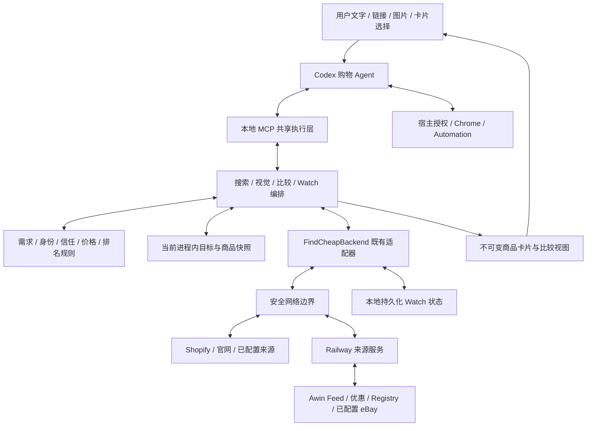

# FindCheap Agent 总设计

> 状态：Q1–Q14 设计决策已获 Chris 确认；实现与验收未整体完成。
> 建立日期：2026-09-06。源码核对基线：v0.17.22，`13e5acff216ef183927ebd087ad5432e8f474c63`。
> 首次建立时仅变更文档。后续本地实现与验证见第 11 节；未发布改动不代表线上或安装缓存已更新。

## 1. 文档地位与使用方式

本文件是业务目标与 Agent 架构的统一设计基准，不是“所有功能已经完成”的报告。

- 第 2、4–10 节是批准的目标规则；第 3 节是已核对的源码架构；第 11 节列出现状与差距。
- 执行开发时按第 12 节拆任务，按第 13 节验收；不能用历史测试结果替代新版本验证。
- 所有改动按 [工业级智能体研发协议](../engineering/agent-development-protocol.md) 依次执行 Research、至少两案 Propose、冻结 Plan、逐模块 Implement 与局部构建、自动断言 Test；协议管研发过程，本文件管业务目标。
- [PRODUCT.md](../../PRODUCT.md) 是产品摘要，[DESIGN.md](../../DESIGN.md) 管回复与卡片样式，[AGENTS.md](../../AGENTS.md) 是开发入口。版本事实和交付证据放在各版本发布记录，不在这里重复维护部署 ID 或商家数量。
- 旧 MVP 总计划与各次修复计划保留为历史；与本文件批准规则不一致时，先记录实现差距，不擅自把源码能力扩大到目标状态，也不按旧方案恢复已退役平台。

产品决策与验收确认：Chris。实现、证据及回滚准备：执行该任务的维护者。发布、商家信任扩展与新增外部权限由 Chris 或其明确授权者批准。

## 2. 产品合同

目标：帮助用户找到符合真实需求、来自可信商家、具有合理价格或有效优惠的商品，完成有证据的比较；购买决定由用户作出。

服务范围是美国购物市场、美元价格，支持中英文。允许检索向美国配送的境外商家；配送未确认时说明限制，不承诺其他国家的库存、当地税费或最低价。回复语言与购物国家是不同字段。

| 用户任务 | 成功输出 | 验收顺序 |
| --- | --- | --- |
| 已知商品：名称、型号、官网链接 | 锁定商品与变体，比较可信商家的同款价格、可购买性和优惠 | 1 |
| 图片找商品 | 优先识别并找同款；符合第 4 节条件时给明确标注的相似款 | 2 |
| 开放需求选品 | 将用途、预算、规格等转成约束，推荐有依据的合适商品 | 3 |

三条路径都保留，分别统计表现；验收顺序不是取消后两条能力。

不建立本地商品目录，不做自动下单、支付、库存预留或登录代购。会话购物记忆、Watch 状态与已有上游 Feed 缓存不是另建全量商品目录。临时匿名报价的受限例外见第 6 节。

## 3. 当前架构与责任边界

当前采用单一 Codex 购物 Agent、确定性工具执行层、既有 Backend 适配器及受限并行检索。保留该结构：模型负责理解和视觉判断，代码负责权限、身份、价格及推荐事实；不为本方案重写后端或增加生产多 Agent 编排。

这是逻辑责任图，不表示每次搜索都调用全部来源；具体 capability、配置和预算决定执行路径。目标中的持久化比较记忆和归档／删除桥接尚未画作现有能力。

2026-09-08 批准 WooCommerce 为与 Shopify Global Catalog 同级的独立 `Backend.catalog.woocommerce` 来源；无品牌品类查询也参与首轮并行，其他来源有结果不阻止它。Store API 是单店公开接口，由既有来源服务持有独立访问表并聚合，访问表不授予商家信任、品牌授权、配送保证或联盟关系。仅使用商品 GET；USD 商品价、父价范围及精确子变体证据分开，不接入 Woo Cart 或结账。

Woo 原始商品 DTO 由不可变快照复制保存，以来源、商家、父商品／子变体 ID 绑定检查、比较、优惠和 Watch；通用 `inspect_selected_product` 按原来源分发，原 Shopify 名称兼容保留。SKU 不作为跨店全局身份。创建所选 Woo Watch 前实时读取锁定目标，可靠初始库存原子持久化；后续只读取该 ID，失败不触发。配置、实现证据和独立宿主验收边界见[WooCommerce 实施记录](../engineering/changes/2026-09-08-woocommerce-independent-source.md)。

2026-09-08 批准对现有 200 家 Woo 商家逐家审查经营身份与支持证据。已核实自有品牌站进入官网与可信库，合格零售商仅进入可信库，其余保留访问资格。官网记录的 `WOOCOMMERCE` 平台通过原 Backend Woo 路由读取，已审核域名仅在既有访问表中优先；不重复调用 Shopify 官网适配器。已知混售独立品牌的商家按零售商处理，避免单品牌整域映射污染商品身份；明确商品品牌不能被商家品牌覆盖。来源注册不授权首选，首选仍通过公共商品、规格、库存、价格与信任门槛。

官网注册表以 `x-findcheap-registry-schema: 2` 协商 Woo 平台；旧客户端保留原平台子集，响应独立 ETag 并带 Vary。数据库审批沿用 Registry Builder，发布前核对旧快照与全部已批准记录，保留旧版本和无关记录。完整决策与限制见[200 家信任审核](../product/woocommerce-merchant-trust-200.md)。

2026-09-08 批准扩至 200 家的执行方案：品牌优先、品类词归一化、稳定的查询相关排序只负责选店，不授予商品同一性或商家信任。规划时先排除当前不可用商家，再填充最多 6 个名额；商品 URL 仍锁定原商家。无效响应仍拒绝，仅对对应商家和搜索请求暂停 5 分钟（进程内最多 2,000 条）；其他关键词和精确 ID 可独立验证，不在失败调用内重试。访问拒绝和安全拒绝维持商家隔离，需运营复核；传输熔断及 Retry-After 单独保留。并发旧成功／失败不能清除较新的隔离或缩短限流。缓存必须与当前选店一致。部署数量以交付证据为准，见[200 家扩容计划](../engineering/changes/2026-09-08-woocommerce-expansion-200.md)。

Railway 来源服务先加载有效 Feed／优惠快照并监听端口，再后台刷新；可配置的 PostgreSQL 保存已发布官网／可信商家 Registry，不是用户对话数据库。来源缓存刷新与本地购物目标的生命周期分开管理。

2026-09-08 后续批准修复胶囊检索并把 Woo 访问表扩至 1,000 家，优先有公开排名证据的商家和常用品类。新增店铺须通过实际 Store API、默认控制器、匹配商品页、完整必选配置和美国市场证据审核；检测到 Woo 技术或返回 USD 不等于准入。别名、区域镜像与重复目录不增加商家数。查询相关选店可使用经商品证据支持的形态标签，仍保持每轮至多 6 家、最多两轮。本地已冻结原 200 加新增 800 家，另有 4 家合格备选；新增 800 家不自动获得信任资格。公开目录位置用于发现优先级，不证明所有入选商家都热门。[数据分母与证据](../engineering/changes/2026-09-08-woocommerce-expansion-1000-data.md)和[实施验证](../engineering/changes/2026-09-08-capsule-search-and-woocommerce-1000.md)单独记录；后续 [v0.18.3](../releases/v0.18.3.md) 已完成生产部署与安装缓存核验，原生宿主验收仍独立。

| 责任 | 当前代码入口 | 边界 |
| --- | --- | --- |
| 工具安全、输入输出校验、模型可见引用回执 | [execution](../../apps/mcp-server/src/execution/tool-executor.ts)、[model-context](../../apps/mcp-server/src/execution/model-context.ts) | 回执不授予权限，外部文本不是指令 |
| 运行时与工具编排 | [server](../../apps/mcp-server/src/server.ts)、[stdio](../../apps/mcp-server/src/stdio.ts) | 当前商品、选择、比较与视觉快照主要在进程内 |
| 需求继承与检索 | [search-products](../../apps/mcp-server/src/search-products.ts)、[requirements-context](../../apps/mcp-server/src/search-requirements-context.ts) | 改预算不等于新建无约束目标 |
| 来源适配 | [backend](../../apps/mcp-server/src/backend.ts) | 包装已有 ports；Railway 不是购物模型运行位置 |
| 视觉候选与复核 | [visual-product-discovery](../../apps/mcp-server/src/visual-product-discovery.ts)、[visual-review-policy](../../apps/mcp-server/src/visual-review-policy.ts) | 模型视觉结论仍经过服务端身份和快照校验 |
| 商家、分层和推荐 | [merchant-trust](../../apps/mcp-server/src/merchant-trust.ts)、[candidate-ranking](../../apps/mcp-server/src/product-candidate-ranking.ts)、[ranking-assessment](../../apps/mcp-server/src/ranking-assessment.ts) | 展示层级与综合首选分开 |
| 比较事实与 UI | [product-comparison](../../apps/mcp-server/src/product-comparison.ts)、[comparison-ui](../../apps/mcp-server/src/product-comparison-ui.ts) | 同一快照 2–4 个选择，不由模型补造价格 |
| 持久化 Watch 与判定 | [watch-store](../../apps/mcp-server/src/watch-store.ts)、[watch-service](../../apps/mcp-server/src/watch-service.ts) | 调度、通知由宿主 Automation 承担 |
| 请求安全与来源服务 | [network-safety](../../packages/network-safety)、[Railway runtime](../../apps/awin-feed-service/src/runtime.ts) | 域名、重定向、体积、超时与来源刷新各自受控 |

旧 Commerce API／ingestion 平台见 [归档说明](../../archive/commercial-platform/README.md)，不属于当前部署架构。

## 4. 查询与图片处理规则

### 4.1 所有入口的共同顺序

1. **解释需求**：区分用户明确要求、已有上下文、图像直接观察与低置信度推断。只询问会改变结果的关键缺项；用户没给品牌时不臆造品牌。
2. **绑定目标**：新商品建立目标；澄清、改预算、补尺寸和继续搜索更新原目标修订，保留其他要求。用户纠正身份时重新核验旧候选，不悄悄撤销无关条件。
   2026-09-08 批准的[咖啡搜索修复](../engineering/changes/2026-09-08-coffee-search-repair.md)使用受控品类词支持泛咖啡向整豆、咖啡粉、胶囊或速溶细化及同形态标签等价，保留具体商品身份校验；受限 Woo 检索可使用泛词召回，候选仍须通过咖啡实物与所选形态证据检查。缺失形态或美国配送证据保留为未核实，不因商家信任或泛词命中而满足硬条件。实现与本轮真实验证状态见 [v0.18.2 记录](../releases/v0.18.2.md)。
3. **编译来源查询**：将中文需求转为来源适用的查询，保留品牌、型号、大类和硬条件；不要把自然语言对话原样当成所有来源的同一查询。
4. **受限并行召回**：调用符合能力与市场范围的 Awin、Shopify、WooCommerce、已配置 eBay 和可识别官网；官网可以提前参与，不强制串行“先官网再 Awin”。已知链接优先用于建立身份与商品证据，读取仍过安全边界。
5. **核验与补搜**：校验商品大类、身份、变体、用户要求、商家和证据。不足时执行有预算的互补查询或官网查询；必要且符合恢复条件时请求宿主授权的公开网页补搜。
6. **输出与继续**：按第 5 节展示，保留稳定引用；有合格结果提前交付。选择、报价、优惠和比较继续使用原目标及服务器生成的引用。

商家被信任不代表该商家的任意商品都符合请求。找假发不能用假发胶带替代；关键词碰巧重合不能把无关大类带入结果。已知商品不自动放宽为其他型号；图片相似款例外仅按下一节执行。

咖啡的实物形态与机器兼容性独立核验。标题／商品类别／所选规格可证明咖啡胶囊形态，缺少可选类别字段不应提前丢弃明确胶囊标题；纯菊苣、生豆、器具、空胶囊不能满足饮用胶囊请求。泛咖啡请求中返回的实物胶囊也需要机器适配证据：用户系统未知或兼容性缺证据时可展示核验候选，不能作为首选，并询问完整机器系列／型号；明确系统冲突排除。商品选项不能倒推用户的机器，选定变体检查与后续目标修订重新核验，旧快照保持不变。

第二轮 Shopify 优先使用绑定实际来源查询的返回游标，在既有两轮预算内取下一页；无游标时仅执行真正不同的受控互补查询，相同查询明确记录无增量。来源状态必须区分已读页面成功与全目录完成；估算总量不等于实际覆盖。Woo 单店不支持能力、来源局部预算用尽不自动否决其他来源或宿主授权的恢复路径，安全／权限／架构拒绝与全局预算边界仍保持关闭。覆盖回执累计本次调用各轮实际请求的店铺、页和请求数，特征条件满足不等于商品身份或机器兼容性已确认。

模糊 Sony `1000XM6` 在用户明确头戴式／入耳式及对应同代型号后，可继续原目标；已明确 WH／WF 型号不能借类别简写互换或换代。澄清保留预算、颜色及其他原要求。商家信任、所在地及配送范围按要求域核验，不作为产品结构关键词；默认美国市场不等于商家必须位于美国。缺少所在地／配送证据仍待核验，USD、市场参数及自述不能补证。

已知商品的版本词应来自当前商品标题、型号或选定规格；FAQ、对照表和交叉推荐不能证明当前商品就是被提到的版本。明确版本冲突排除，缺少版本证据保持待核验，不将缺证据冒充已证明冲突。服装中的 mini 长度和 regular 版型不因此改作型号版本。

### 4.2 图片：同款优先，相似款明确分开

先提取大类、可见品牌／款式线索、轮廓、结构和显著特征，再检索元数据与候选商品图，由当前 Codex 会话看图复核，最后由服务端核验候选 ID 与证据。仅凭视觉像，不能生成已确认同款身份。

检索大类始终不变；用户明确提出的品牌、颜色、尺寸、预算等仍是硬条件。仅由图片推断的细节可有限放宽，但不能把这次放宽写回为用户原始要求。

| 情况 | 用户看到什么 |
| --- | --- |
| 同款身份与所需变体得到确认 | 同款结果；按证据说明价格及库存 |
| 本次计划内可用来源和必要补搜已完成，仍无同款 | “本次检索未找到同款”，再给核验过的相似款 |
| 超时、上游失败或授权未通过 | “同款检索尚不完整”；可展示已核验相似款，但不声称商品不存在 |
| 找到同款且明确缺货 | 保留同款信息、说明缺货，提出补货 Watch 选项，再给可购买的相似款 |
| 没有足够相似的可信候选 | 不凑卡片，说明尚缺哪类证据及可选下一步 |

黑色蕾丝短裙的批准相似方向是：**其他品牌的同色同结构款**，以及**同品牌、结构相近的蕾丝短裙其他颜色款**。不预设两者中哪类必然更好，按结构相似度、需求满足与价值证据排序；逐项标明品牌／颜色等变化。若用户明确“必须黑色”或“必须同品牌”，对应变化不得自动出现。

同款与相似款不能混在“同款最低价”结论中。进入相似推荐模式后，可以指出“这些相似款中值得先看”的结果，但不能借此升级成同款或绕过可信商家与硬条件。

现有两轮视觉复核及请求上限是安全基线，不因批准 3 分钟体验目标就自动取消。候选图未加载或未经复核时不得伪造视觉通过；补搜只传必要描述，不另行上传用户原图。

## 5. 商家信任、三层卡片与综合推荐

### 5.1 信任与商品事实分开

Chris 已人工验证的 Awin 商家归为**已验证可信商家**。不因来自 Awin 就默认附加“商品质量证据不足”警告，也不自动标为“高质量首选”。其他商家按已审核的官网／商家记录判断，不能仅凭平台身份、评分或模型陈述升级信任。

2026-09-07 新批准的第二层准入：商品评分或商家评分任一达到对应门槛，并满足当前需求、商品价及安全要求，可以展示在第二层。商品评分标“高评分商品”，商家评分标“高评分商家”；评分不改变商家独立审核状态，不自动授予综合首选、第三层性价比或报价权限。商品沿用 `>3.8/5` 且至少 2 条评价的门槛。商家评分必须有真实商家对象、来源与独立定义的门槛；eBay 好评率／反馈分不能冒充商品五星评分及评价数。商家评分来源与准入门槛尚未接入，不能声称该分支已可用。

可信资格不等于每件商品的功效、材质、库存、品牌授权、Coupon 适用性都已证实。具体要求仍需要对应商品证据；评分只能按来源说明，不保证效果。已知风险、冲突域名或身份异常继续阻止推荐。

现有 Awin 路径承接“人工验证过的来源集合”这一业务前提；若扩充集合，应保留审核记录及商家 ID／域名对应关系，而不是让新增任意联盟商家自动继承人工审核结论。

### 5.2 分组与排序

| 展示组 | 进入条件 | 空组处理 |
| --- | --- | --- |
| 第一层：官方同款 | 品牌身份明确，有经核验的官方匹配；可来自用户文字、已确认图片身份或官网链接 | 隐藏，不用泛品类官网占位 |
| 第二层：可信商家与高评分匹配 | 满足当前任务要求，来自已审核可信商家，或商品／商家评分满足第 5.1 节；评分对象和实际审核状态分别标明，相似项另标身份与差异 | 隐藏，不放无关商品补数 |
| 第三层：性价比选择 | 匹配与信任合格，并有可比价格、单位价格或已确认优惠优势证据 | 隐藏，不把剩余便宜商品自动放入 |

保留现有最多 2／3／3、总计最多 8 张的展示上限，不把它当成必须填满的数量。已知同款任务保持精简，通常 0–3 个有用结果。相同商品报价不重复占多个组；不同商家的同款报价可以作为不同 Offer 比较。

普通品类发现填充可信组时，优先保留不同款式；同一来源、商家和明确变体商品路径可作为展示家族。后续规格在原位置折叠，保留各自原始 ID、价格及选择控件；首选或已选规格展开。展示家族不是同款身份或价格可比证据，不影响已知同款、显式跨商家比较或图片复核。

分组不是全局优劣排名。官方第一组不必是综合首选；综合推荐从合格候选中，先满足需求，再比较匹配、可购买性和可比价格，给出简短依据。优惠只有事实上的价格／条件优势才有价值，佣金与联盟收入不参与排序。

未知库存与明确有货不同；可以带限制展示，但不能称“确认可购买”。尚未核验的研究线索不冒充三层推荐，不能因推荐不足而自动转正。回复风格和视觉层级集中维护在 [DESIGN.md](../../DESIGN.md)。

初次搜索、查看规格及报价等派生快照共用最终资格检查；匹配展示资格与综合首选资格分别计算，不能绕过身份、要求、对应准入证据及安全限制。已有合格高评分匹配但没有独立审核首选时，说明“有符合要求的匹配”，不再把这些商品总结成“只有研究线索”。比较摘要以最终卡片计算，不能沿用来源池或单件检查的数量。检查不改变旧快照的顺序、价格和选择 ID。

缺少经过核验、对应当前商品／规格的商品价时，不生成商品卡或新的可选比较项；可以保留有界内部线索用于后续核验。已有商品价、仅运税或到手价未知的卡片保留，并明确未报价。缺价不得填零、用其他规格起价或用未确认的优惠价替代。过滤在新快照分配卡片引用前完成，不改写历史快照。

## 6. 比较、价格、Coupon 与受限报价

卡片多选和 `Compare selected` 必须由 UI 提交同一不可变快照的真实 ID，不能要求用户使用不存在的控件，也不能由模型按名称猜测已选对象。普通比较省略非必要 `focus`，遵守当前 schema 上限。

查看单件规格直接解析原快照的唯一已同步选择；未同步、空选、多选和过期分别说明，不强制先调用 2–4 件比较。需要累计检查多件商品时，逐次使用上一检查返回的新快照及其引用；独立并行分支不自动合并，也不使旧父快照失效。

查询已选商品优惠同样可只传原 renderId，解析该快照唯一已同步选择；明确序号才传 position／selectionId。请求开始时锁定目标与选择修订，途中改选不切换本次优惠对象。未同步、空选、多选、过期及外来引用不以第一张卡补位；失败不请求优惠来源。

比较视图（独立与卡片内嵌入口）固定九项顺序：**商品、规格、对比价格、商品价、质量依据、到手价、优惠、商品状态、商家信任**。库存合并到商品状态；单位价格证据并入对比价格；规格保留未满足要求与视觉差异。精简展示不删除后台校验或隐藏影响购买决定的限制。

Awin 标题中的明确变体后缀，只有数字变体链接与来源商品 ID 相符时才作为“商家标注规格”显示；保留原文，不推断缺失单位、颜色或质量认证。无法明确绑定的规格仍未知。

颜色要求以选定变体为准，商品共享描述中的模特色／其他配色不能替代选定颜色；缺少变体颜色时，仅使用明确商品标题颜色，否则待核验。卡片报价能力与执行共用静态目标资格，实际报价仍需当前授权与再次核验。单件报价回执绑定本次实际解析的原 renderId／selectionId 和选择来源；失败不改成其他 UI 选择，也不将已过期或外来 ID 声称为有效目标。优惠工具按当前 responseLocale 返回解释，保留商家原始名称、优惠码和来源事实。

- **同款报价比较**：同一已验证身份、变体及 condition 才可进行；否则标作不同商品选择比较。
- **价格口径**：默认使用核实商品价。只有全部比较项都有未过期且条件一致的到手价，才统一切换；不得混算含税与不含税价、不同数量或不同会员资格。
- **优惠展示**：区分商家级优惠、商品已确认适用、尚未确认适用。商家有 Coupon 可以提示“该商家有优惠”，但不能冒称当前商品必然可用；按有效期、门槛、资格、来源和检查时间说明。
- **优惠后价格**：仅在商品适用条件及计算依据明确时计入。未确认叠加、返现、积分、未来奖励不计入实际到手价；不声称穷尽全网最低价。
- **优惠一致性**：排序、原始卡片标签、比较及所选优惠研究共享资格评估；跨卡片按商家／来源域与优惠 ID 去重计数。原始 `NO/N/A` 条款保留为缺失证据；明确全场优惠且无门槛／新客／批发／冲突限制时，只能成为需商家确认的候选，不能据此确认商品适用或扣减价格。简短摘要只突出服务端推荐项；完整来源证据保留在结构化结果。
- **到手价请求**：用户主动要求后，再取得必要邮编和报价授权；不索取完整地址或登录凭据。
- **临时匿名购物车例外**：仅限明确报价请求，且对应接口已审核确认不会预留库存时启用；不登录、不提交订单、不付款。它是受限外部写操作，不应在技术文档中描述为纯读取；未知副作用时返回不支持报价，不执行试探性写入。

恢复旧比较时保留当时的选择与历史证据；刷新产生新的观察版本，不覆写旧卡价格。展示“未报价／不支持报价／报价失败”与缺失金额，不把任一状态当作零费用或无优惠。

## 7. 预算、补搜与结束条件

批准体验目标：**普通搜索 90 秒、图片搜索 180 秒内给结果或阶段性说明**。这是从本次请求开始的系统主动处理时间，包含模型、工具、视觉复核与补搜，用户回答／授权等待单独记录。还应报告总墙钟时间，不能只统计网络活跃时间隐藏延迟。

有合格结果即可先展示；阶段性说明不是“成功找到商品”，不得计入检索成功率。请求继续时保留原要求和已完成来源记录，明确新的有界工作，不能用改名新目标绕过原预算。

执行层负责聚合预算、取消和终止；每来源超时、重试、并发、图片读取、网页授权租期和 API 配额仍独立受限。沿用已配置和获准来源，新增付费供应商或额外上传需另行批准。

| 结束或恢复原因 | 处理 |
| --- | --- |
| 已有足够合格结果 | 交付结果，说明本次检索范围；不为填卡片继续请求 |
| 首轮不足且还有预算 | 受限互补检索；同款比较仍保留必要来源覆盖 |
| 服务端允许网页恢复 | 请求宿主一次性授权，再执行规定的公开网页工作；模型声明不是授权 |
| 超时、429、上游故障 | 仅对允许的暂时故障做有界重试；能交付的有效结果不丢弃 |
| 拒绝、取消、授权能力不可用或过期 | 停止该路径，说明未完成；不能把宿主自动拒绝写成用户点击拒绝 |
| schema、身份、权限、网络安全失败 | 保留安全边界，纠正可纠正参数；不能伪装暂时故障来启用补搜 |
| 时间或请求预算耗尽 | 取消剩余工作，给结果／阶段说明及可选下一步，不无限重试 |

具体请求数与阶段切分属于实现参数，必须经过匹配环境的端到端测量后配置；不能把现有工具 30 秒超时直接改成 180 秒就宣称达成体验目标。

同一购物目标的网页授权拒绝、取消及其他不可重试终态，不因查看规格、明确版本或调整预算生成新 renderId 而重新申请。一次授权令牌仍只绑定实际批准的原快照；派生快照不能继承令牌。仅服务端明确允许的暂时授权异常保留一次重试，不能由模型重置次数或把目标改名绕过停止状态。

网页补搜在授权前枚举可用 Chrome 并保留实际浏览器 ID；枚举不打开网页。授权后留出至少 15 秒用于服务端核验。浏览器不可用、发现超时或取消时，以原 renderId／令牌和空 URL 列表收尾；过期后只允许零 IO 终态记录，不延长读取权限或重开授权，不改写原卡片。该结果是调用方报告的发现状态，不冒充宿主根因诊断；浏览器启动速度仍需原生验收。

## 8. 会话身份、持久记忆与生命周期

### 8.1 目标与选择连续性

当前 `goalId`／`goalRevision`、`renderId`、`selectionId` 和 `findcheapContext` 回执继续作为业务引用。澄清或改预算继承原目标；旧候选按新需求重新核验，明确不合格原因，不悄悄替换用户选中的商品。

目标是同一任务跨 MCP／Codex 重启仍可恢复比较，跨任务默认不混用。恢复历史不恢复过期网页授权，也不把旧价格或库存当作新的事实。持久化历史和短期报价／授权有效期必须分开。

### 8.2 最少本地状态

保存需求、结构化图片特征、已确认商品身份与链接、颜色尺码、卡片顺序、选择、比较结果、价格及检查时间、Watch 关联。数据按本机用户／安装及宿主任务作用域隔离，采用受限本地访问和可校验、可迁移的格式；并发写入、崩溃恢复与删除必须可测试。

不另存完整聊天、用户原图、凭据或完整地址。重新看图确有必要但附件不可访问时，向用户重新索取。仅存当前任务实际用到的购物证据，不以此建设本地商品目录或跨任务画像。一般诊断日志不复制这些内容。

### 8.3 归档、删除与 Watch 联动

| 宿主任务状态 | 购物记忆 | Watch |
| --- | --- | --- |
| 正常／重启 | 保留并恢复需求、选择和比较历史 | 按已批准条件运行，不因重启重复创建 |
| 归档 | 封存，不再主动使用 | 暂停关联调度 |
| 取消归档 | 可恢复历史 | 保持暂停，需用户主动恢复；不静默延长期限 |
| 删除 | 清除该任务购物记忆，不影响其他任务 | 停止关联调度并清理对应记录 |

宿主归档／删除事件接入尚未验证。MCP 连接 ID、进程退出、模型传入的任务 ID 都不能直接充当可靠的宿主身份或删除信号；当前 shell 有任务环境变量也不证明 MCP 一定收到稳定身份。

实现必须先验证：同任务重启后身份稳定、不同任务隔离、MCP 获得可信绑定、归档／删除能可靠通知或通过官方状态入口核实。无需读取整个 Codex 聊天数据库来猜测事件。

在接入通过之前，完整生命周期标记为待实现／待验收，提供明确的主动清理入口，不能宣称“删除对话后本地已自动清净”。清理应可幂等重试：先阻止继续使用／发通知，再停止宿主调度，最后清理该任务数据；失败时报告未完成步骤，保留最少的待清理标识，不复活已删除状态。主动清理未接入前同样不能声称已可用。

## 9. Watch 合同

缺货时先告知同款缺货并提供 Watch 选项，用户明确同意后才建立。默认**每小时一次，持续 30 天**；用户可指定频率和期限，但仍受来源与宿主限制，不能悄悄改成不支持的节奏。

建立前锁定商品、商家范围、颜色／尺码及可靠库存来源。没有可靠来源时说明暂不支持，不建立空监控。先持久化规则并绑定一个宿主 Automation，必须同时核实真实宿主调度、作用域和本地绑定成功，才称“正在监控”；模型提交或本地记录一个 Automation ID 不构成宿主成功证据。失败应撤销新建的孤立调度，不能重复创建。

补货触发必须是指定变体的**已确认缺货 → 已确认有货**，保留来源与检查时间；未知库存、查无记录和请求失败均不算缺货基线或补货。首次缺少可靠前态时不能伪造这个转变。

首次确认补货后通知一次并停止相关调度；到期、用户停止、归档或删除也必须同步本地状态与宿主任务。通知去重不等于停止调度。失败与无变化保持安静，不产生虚假的补货消息；长期不可用应报告监控能力受损。

Watch 不进行交互式图片复核、自动 Chrome 操作或购买。机器休眠、宿主不可用时不承诺持续在线监控；需要在实际宿主中验证运行条件。保留现有其他 Watch 类型，但不把补货需求扩大成自动交易权限。

## 10. 执行安全与授权

本系统主体是只读购物研究；本地记忆写入、定时监控及受限匿名报价另有副作用，不能以“只读”一词跳过控制。

| 操作 | 执行依据 | 停止边界 |
| --- | --- | --- |
| 已配置来源检索、安全商品页／图片读取 | 当前用户购物请求、能力与来源策略 | 不绕登录、CAPTCHA、域名／重定向／体积限制 |
| 公开网页补搜 | 服务端恢复资格及有效宿主授权 | 拒绝、不可用、过期、租期／预算耗尽即停止 |
| 受限匿名报价 | 第 6 节明确报价授权和副作用核验 | 不下单、付款、登录或预留库存 |
| Watch | 第 9 节明确同意、已核实真实宿主调度及本地绑定 | 不自动购买；归档／删除按第 8 节处理 |
| 本地比较恢复与清理 | 经验证的任务作用域、批准的数据生命周期 | 不跨任务恢复，不从旧状态复活权限 |

共享 executor 统一输入／输出 schema、capability、错误码、输出限额和外部数据隔离；网络层统一目的地、重定向、私网访问与传输限额。身份、功效、信任、价格和排序仍在对应领域模块，不以提示词代替代码约束。

模型、页面、Feed、图片文字和工具返回的字符串都不能修改权限；服务端引用需保持来源与作用域。安全失败应关闭对应路径，非关键来源故障可以明确降级。敏感日志只保留必要的脱敏原因码、hash、计数和时间，不保存 Feed 私有 URL、API key、原图或完整聊天。

## 11. v0.17.22 基线与本地实现差距

2026-09-08 Sony 澄清／商家要求／已选优惠／补搜收尾及精简卡片的[五阶段记录](../engineering/changes/2026-09-08-search-continuation-selection-ui.md)记录代码与测试，后续获批的交付状态见 [v0.17.34 发布记录](../releases/v0.17.34.md)。Chris 已确认本次交互审批模式弹窗可见，结合两次 ACCEPT_TRUE 回执，该模式的可见接受路径通过；不代表 Full Access、取消、报价或修复后的 Chrome 完整补搜已验收。历史 Sony SCHEMA_INVALID 字段仍未知，本轮补齐固定阶段／原因诊断，不宣称所有官网兼容问题已消失。

2026-09-07 后续高评分／缺价／单选及连续检查的[实施与验证记录](../engineering/changes/2026-09-07-high-rating-price-selection-followup.md)：合格商品评分可进入第二层但不升级商家审核或综合首选；无有效商品价不出卡，派生摘要／模型回执同步；单件检查解析原卡片唯一 UI 选择，多件顺序串接明确子快照。137 文件／2,030 项本地默认回归通过，尚未发布；商家评分来源／门槛及真实 UI 仍未接入／验收。[原生授权诊断](../engineering/changes/2026-09-07-native-elicitation-diagnosis.md)已定位桌面能力握手与 never 策略的兼容性原因，但不代表宿主弹窗已修复。下表的历史基线和其他未完成项目保留。

2026-09-07 后续本地身份／快照／授权一致性修复见[五阶段记录](../engineering/changes/2026-09-07-snapshot-identity-consent-consistency.md)：版本词取证、派生卡片资格与最终计数、目标级授权停止及完整轨迹负例。是否构建、验收与发布以该记录的实测状态为准；这些代码改动不代表 Codex 原生授权弹窗已经修复，也不解决下表中的宿主生命周期和独立样本验收缺口。

v0.17.28 的优惠／规格／变体展示修复见[事实、计划与验证记录](../engineering/changes/2026-09-06-wig-coupon-spec-contract.md)。这些局部修复不改变以下宿主授权、持久记忆、Watch 与独立验收缺口；[发布记录](../releases/v0.17.28.md)单独列出门禁与发布范围。

下表核对既有基线与首批实现，不是新的线上健康证明。首批打包为 [v0.17.23](../releases/v0.17.23.md)，部署与安装须分别核实；历史基线见 [v0.17.22 发布记录](../releases/v0.17.22.md)。2026-09-06 的事实底稿、两案比较、冻结计划及逐项验证见 [首批设计对齐记录](../engineering/changes/2026-09-06-design-alignment-batch-1.md)。本地离线断言不能替代真实图片、宿主生命周期或线上验收。

0.17.26 后续本地的颜色／报价／九项比较／Coupon 语言修复与验证见[本轮实施记录](../engineering/changes/2026-09-06-comparison-quote-color-followup.md)。该记录区分本地断言通过、宿主即时拒绝仍未解决、尚未发布安装；不将这些修复视作跨重启记忆或真实授权验收完成。

第二批改动见 [第二批设计对齐记录](../engineering/changes/2026-09-06-design-alignment-batch-2.md)及[集成／六图实测记录](../engineering/changes/2026-09-06-batch2-final-verification.md)，本次单独打包为 [v0.17.24](../releases/v0.17.24.md)。第二批主要模块及实测触发的V8终态修正已完成本地实现，最终108文件／1,594项自动回归通过；真实验收仍有缺口。六图只对应修正前固定产物，不能当作V8新增实测；部署与安装另行核验，不由本地测试推定。

2026-09-06 后续 T1–T9／六图问题的[批准方案与实施证据](../engineering/changes/2026-09-06-acceptance-1-9-improvement-plan.md)记录本地新增：官网 URL／明确变体绑定、多商家比较完成条件与补搜保留、单件选择报价、视觉纠正和终态回执、二轮结构查询。类别澄清现支持一次原快照绑定的跨请求等待，单列 observedClarificationWaitMs；不计作宿主表单确认，也不重置服务／图片／两轮预算。该轮尚未发布或替换缓存；实际宿主授权、模型回复、真图命中及独立样本验收仍待完成，不改变下表的生命周期／Watch 缺口。

| 领域 | 已核对现状 | 为达到本文目标还需做什么 |
| --- | --- | --- |
| 执行层／Backend | 统一执行边界、既有 ports、文本可见引用回执已存在 | 新增持久作用域和预算策略仍要经过同一边界 |
| 检索与官网 | 并行首轮、受限互补与官网补搜已存在；并非严格按展示组串行。v0.17.25 的[修复记录](../engineering/changes/2026-09-06-known-product-recovery.md)补齐缺失品牌取证、显式货况保留、变体隔离和固定 Sony 官网适配；[发布证据](../releases/v0.17.25.md)单独记录 | 核验完整用户目标轨迹，不以单来源首屏证明无商品。宿主拒绝不等于用户点击拒绝；实际弹窗能力仍待宿主验收 |
| 胶囊检索与来源覆盖 | 本地后续修复统一咖啡形态证据、独立机器适配、实际分页／互补、局部来源恢复及累计回执；[实施与实测记录](../engineering/changes/2026-09-08-capsule-search-and-woocommerce-1000.md)区分源码、实时上游和安装状态 | 三来源参与仍是受限召回；正常分页上限与故障分开报告，新旧 Woo 客户端通过请求能力协商覆盖元数据；[v0.18.3](../releases/v0.18.3.md) 分别记录代码、生产、安装 SDK 与原生宿主验收状态 |
| WooCommerce 独立来源 | 可选跨店聚合、首轮搜索、精确变体、混合比较、优惠与 Watch；本地访问表已冻结 [1,000 家](../engineering/changes/2026-09-08-woocommerce-expansion-1000-data.md)，与信任表隔离；商品价不等于到手价 | 历史发布的 [200 家访问表](../product/woocommerce-merchants-200.md)及 [137 家官网、45 家可信零售](../product/woocommerce-merchant-trust-200.md)审查不自动扩展至新增 800 家；每轮最多 6 家／每次检索最多两轮；v0.18.3 千店已部署且安装缓存已核验，原生图片／选择及真实 Watch 生命周期仍独立验收 |
| 图片与相似项 | 第二批本地已有服务端复核后的自动相似兜底、缺货同款保留、比较中的相似身份及差异；换图／变体撤销旧视觉资格；有效视觉证据核对硬要求，相似首选要求有货；异色候选要求明确同品牌来源证据 | V1–V7 局部32文件／612项通过，原生与网页恢复共用联合门槛。真实六图带品牌开发样本：对应款式5/6、指定配色链接4/6，不代表运行时确认同款；Nataly和Belden原配色仍有缺口，独立验收未完成 |
| 卡片／Awin 信任 | 三层、避免重复、价格／优惠价值门槛和人工验证 Awin 来源信任路径已存在 | 核验全部新规则；Awin 尚无逐商家审核时间／审核者字段，来源集合需可追溯 |
| 时间 | 第二批已实现90／180秒单调 `SERVICE_OBSERVED_FLOW` 预算与取消；原生第二轮及网页补搜继承原预算，仅真实授权等待暂停；仍保留30秒活跃网络预算、单工具时限及请求计数 | 不是完整宿主用户回合保证：重复初始检索可新建flow，宿主首调用前／终态后的时间未纳入；可信回合绑定、阶段体验与P95仍待验收 |
| 比较记忆 | 商品、选择、比较使用进程内 Map；本地首批已保留同一卡片视图返回后的选择和递增版本，并隔离迟到比较／报价／hydration响应 | 商品快照仍有短期 TTL；iframe重建、任务隔离持久化、重启恢复、迁移与主动清理尚未实现 |
| 归档／删除 | 未验证宿主事件及稳定任务身份接入 | 完整接入、调度联动、幂等清理及真实宿主验收 |
| Watch | 保留默认30天／60分钟及旧记录期限；第二批内存与JSON存储加入版本校验、跨实例原子写、删除防复活和Automation ID占用保护；工具与说明采用本地先停，终态／待停止规则不能恢复；停止意图不充当宿主确认 | W1–W3 局部验证完成，主执行者独立复跑6文件／72项通过。可靠来源准入、真实绑定及停止宿主调度未完成；旧记录不自动迁移期限，旧写入器不能与新格式并发运行 |
| 补货证据 | 要求同merchant/source/handle/变体/condition的可靠OUT_OF_STOCK→IN_STOCK；第二批首次转变原子保存COMPLETED、事件ID及已绑定规则的STOP_REQUIRED，之后零来源调用；未知／失败／聚合库存不伪造前态 | W2 最终局部5文件／64项通过，包括重启和迟到结果竞争；真实商品库存语义、通知实际送达一次及停止宿主调度仍待验收，事件ID不是恰好一次送达证明 |
| 优惠／报价 | 第二批本地显式报价要求当前 MCP 表单接受、原商品／变体／ZIP／选择再验证及短期单次 permit；固定 API 与返回商品身份校验，取消或迟到结果不写入。到手价 Watch 不调用 Cart，也不在澄清中推荐这一不可用选项 | QR／W 最终局部13文件／238项通过，主执行者独立复跑授权25项通过。实际桌面授权、商家报价与副作用验收仍未完成，模拟表单不代表真实授权通过 |
| 业务验收 | 第二批集成门禁及六图固定原输入、实际来源／候选图／MCP终态均有记录；开发样本没有冒充独立准确率 | 至少40张冻结样本、带／不带品牌与基线／候选对照，完整桌面授权及重启／生命周期／Watch轨迹仍待验收；不能称整体设计已完成 |

2026-09-07 一致性修复见[事实、计划与验证记录](../engineering/changes/2026-09-07-identity-offer-outcome-consistency.md)，另按授权打包为 [v0.17.30](../releases/v0.17.30.md)，发布和安装证据独立记录：规格不充当型号；请求名称／版本核验与稳定同款身份分开；同一已绑定商家变体报价跨来源合并，但保留来源引用和完整观察；推荐、比较计数与补搜文案使用最终结果。已通过默认自动回归和三个真实接口开发案例，未代替原图身份、原生宿主或独立样本验收。

## 12. 实施里程碑

2026-09-07 包装／续搜／报价反馈修复见[事实、两案、冻结计划与验证记录](../engineering/changes/2026-09-07-package-continuation-quote-feedback.md)。明确包装数量和净含量规范为独立硬要求；用户确认未指定的护肤品版本时保留原目标及其他条件，较长名称须绑定原候选。两处比较区分授权、引用和结果未知，不因 UI 超时宣称购物车未创建，不提示盲目重试。详情失败提供安全原因码，不放宽精确目标核验。该局部实现不代表原生宿主授权或整体设计已验收。

以下是完整目标的开发分解，不是全部完成或已获发布授权的声明。已批准实施范围以具体变更记录的冻结计划为准。每个里程碑再按研发协议输出事实底稿、至少两案比较和具备依赖关系的原子计划；以现有模块增量修改，不并行重写全部系统。

1. **基线与合同**：冻结本文场景、现有评测集与版本；为预算、图片兜底、Watch 和恢复建立先失败的回归。完成条件：每个待改规则有可观察输入、预期输出与失败用例。
2. **检索与展示**：在现有编排中统一同款／相似路径、缺货分支、三层推荐和 90／180 秒分阶段预算。完成条件：有结果与不完整结果均能准确结束，安全拒绝不会触发绕过。
3. **本地记忆与宿主接入**：验证可信任务绑定，再实现最少持久状态、跨重启引用和归档／删除处理。完成条件：第 8 节真实宿主场景通过；仅存储层通过不得标记全完成。
4. **Watch 与报价**：实现默认期限、可靠补货前态、一次通知后停止及生命周期联动；核验报价副作用与授权。完成条件：规则、调度、通知和失败补偿一致，无孤立监控。
5. **独立验收与交付**：按下一节分别判定单项修复和整体目标。获明确发布授权后才执行提交、部署与安装验证。

## 13. 验收、可观测性与发布

### 13.1 两种不同的完成结论

- **单项修复完成**：相关回归、安全检查及真实故障场景通过，可以在另获发布授权后交付该修复；不能宣称整个设计已完成。
- **整体设计达标**：独立真实样本及实际 Codex 图片、补搜授权、卡片选择、比较、重启、归档／删除、Watch 全流程均有证据。缺证据写“待验收”，不能用模拟宿主或增加测试数量替代。

| 必须覆盖的验收族 | 可观察通过条件 |
| --- | --- |
| 已知商品与需求继承 | 型号／变体、预算、用途等不被悄悄撤销；旧选择不被替换；不返回无关商品凑数 |
| 图片同款与相似兜底 | 同款有身份依据；两类批准相似方向标差异；硬要求不放宽；明确区分无同款、不完整与缺货 |
| 信任与三层排序 | 已核验 Awin 按可信处理；合格高评分进入第二层但不伪造独立审核／首选；评分对象真实，缺商品价不出卡；无重复占位，无佣金加分，空层隐藏 |
| 比较、Coupon 与报价 | 真实同快照 ID、共同价格口径、优惠适用性及金额正确；无权限与副作用越界 |
| 时间与故障 | 成功和失败路径均验证 90／180 秒目标；报告主动时间、用户等待、总耗时与阶段结果；无无限恢复 |
| 重启与隔离 | 同任务恢复原需求和选择，旧事实保留时间；不同任务不串数据，旧授权不复活 |
| 归档／删除与清理 | 真正宿主事件触发正确状态；失败可重试；取消归档不自动恢复 Watch；不影响别的任务 |
| Watch | 有效缺货基线、指定变体有货触发一次并停止；未知／故障不触发；30 天期限和调度同步生效 |
| 安全与异常 | 注入、恶意 URL／跳转、无效／过期引用、取消、429、超时、缓存损坏和并发写入不会越权或丢失选择 |

分别报告同款准确性、相似款相关性、有效结果覆盖率、可用样本上的任务成功率、来源覆盖和耗时。返回空集的精度未定义，不能记为 100%；阶段说明不算找到商品。开发样例与独立验收样例分开，保留失败项与分母。

沿用 [业务评测记录](../product/shopping-improvement-implementation-2026-09-05.md) 的既有门槛：至少 40 个独立 held-out 任务，其中 20 个文字、20 个图片任务，至少 4 个品类；Recall@20 ≥ 90%、Precision@3 ≥ 95% 并报告推荐覆盖、eligible task success ≥ 85%。这是已有评测合同，不是本轮新测结果或对任意商品的成功保证。

[视觉验收合同](../testing/visual-search-acceptance-v2.md) 另要求至少 40 张可检索、人工确认的真实图片，至少 10 张 supported held-out 图片，按款式家族划分，分别在有品牌／无品牌模式比较基线与候选，并保留该合同的视觉指标门槛。业务集中的 20 个图片任务不能代替这套验收，两套要求分别适用。此前的 6 件衣服仍是开发样例，不能证明泛化准确率。

新增场景的样本、评分定义及证据版本应在验收前冻结，不能观察结果后改门槛；本文件不降低既有门槛。今后变更阈值时同步相应评测合同与本节，不用历史 PASS 覆盖未完成的宿主验收。

### 13.2 日志、回滚与文档维护

记录目标关联的脱敏 trace、版本、来源原因码、请求计数、耗时、候选漏斗、恢复与授权结果，以及 Watch 调度／清理状态。恢复历史与新来源观察分开，不能重复计数制造召回提升；不记录隐藏推理或私有原始输入。

影响运行行为的版本发布需要固定源码与构建版本、相关完整测试、实际宿主核验及可回滚的旧版本；纯文档变更按 [AGENTS.md](../../AGENTS.md) 做链接、一致性和 diff 验证。Railway、GitHub、安装缓存是分别验证的交付物，不能互相代替；流程入口见 [发布记录](../releases/v0.17.22.md)。持久数据新增格式必须保留兼容／迁移边界，回滚不能复活已删数据或丢弃活跃选择。

身份、信任、价格、选择隔离、授权出现违反，或持续超预算／重复通知时，停止受影响能力并回滚对应版本；保留脱敏故障证据，加入回归。只读上游暂时失败时保留可用旧来源缓存及其时间，不伪称新数据。

以后修改规则时同步本文对应章节、实现状态和测试；发布记录填写实测证据。业务目标变化需用户确认。宿主生命周期能力、来源副作用或真实验收未证实的地方保持显式未完成，不以新的计划覆盖旧缺口。

## 14. 审批索引与历史入口

以下仅定位规则，不重复定义：Q1 → 第 1 节；Q2／Q5 → 第 2 节；Q3／Q8 → 第 5 节；Q4 → 第 7 节；Q6／Q7 → 第 4 节；Q9／Q11／Q14 → 第 8 节；Q10 → 第 9 节；Q12 → 第 6 节；Q13 → 第 13 节。

追查设计原因时可读 [执行层／Backend／比较](../product/execution-backend-comparison-v0.17.0.md)、[需求与比较改进](../product/requirements-to-comparison-improvement.md)、[六工作包记录](../product/shopping-improvement-implementation-2026-09-05.md)、[Prompt 精准度记录](../product/prompt-precision-implementation-plan-2026-09-05.md)；它们不是本轮新目标的完成凭证。早期 [MVP 总设计](../superpowers/specs/2026-08-13-ai-transaction-agent-mvp-design.md) 与 [总计划](../superpowers/plans/2026-08-13-ai-transaction-agent-mvp-master-plan.md) 中的退役架构不再作为实施入口。
