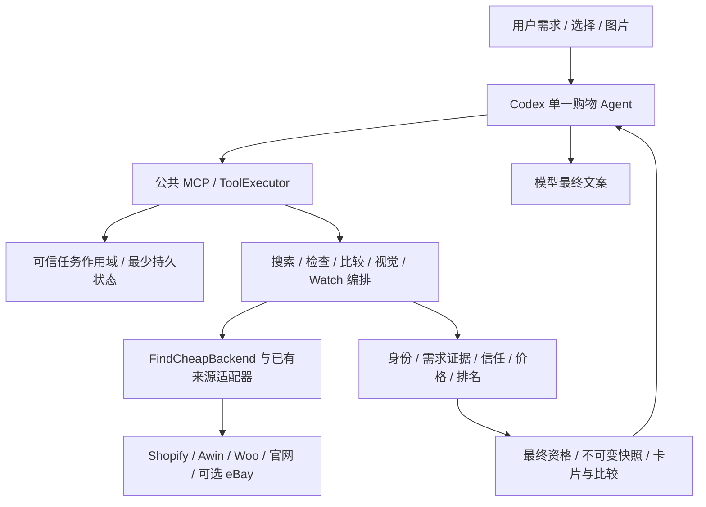

# v0.18.7 Agent 结构与设计符合性审查

日期：2026-09-14。源码基线：`02db6fbd622d96c9f3e4319146ab4771d90fd12a`，工作区开始时干净。
范围：只读审查当前源码、v0.18.3 至 HEAD 的修复、已有原生回执，以及本次隔离公共 MCP 反例。未修改生产代码、升级、发布、部署或替换缓存。

## 结论

两种情况都有：执行安全、目标持久化、身份锚点和最终卡片资格等修复已经形成可复用规则；部分商品语义仍靠特定品类、型号、角色和文字表达的专项处理。总体架构方向符合批准设计，业务规则与输出尚未整体达标。

最重要的新发现不是文件太大，而是共享要求评估器存在三类错误。使用实际公共 `search_products` 调用、仅替换来源数据，三个不应推荐的反例全部进入 `READY` 首选，要求状态为 `SATISFIED`。统一入口保证规则被共同执行，却不能保证规则本身正确。

本次抽查相关已有测试为 3 文件、73/73 通过；新探针 1 个正例通过、3 个负例失败。两组分母独立，不换算成业务准确率。

## 1. 对照基准

- [AGENTS.md](../../AGENTS.md)：开发入口、简洁改动、规则同步、分开报告实现与验收。
- [Agent 总设计](../architecture/agent-design.md)：业务与架构的批准基准，尤其第 3–10、13 节。
- [DESIGN.md](../../DESIGN.md)：卡片与最终回复样式、事实边界。
- [研发协议](../engineering/agent-development-protocol.md)：公共接口验证、独立预期与真实验收边界。

总设计第 11 节明确是历史基线，不能把其中旧“未完成”行直接当作当前代码缺陷。本次以源码和最新回执校正。

## 2. 当前实际结构



这是逻辑图，来源是否执行受能力、配置和预算控制。来源服务持有 Feed/Registry/Woo 访问表，购物模型仍运行在 Codex。

主要入口：

| 模块 | 当前职责 | 评价 |
| --- | --- | --- |
| `execution/tool-registry.ts`、`tool-executor.ts` | 注册、输入输出校验、capability、安全错误、外部文本隔离 | 真正共享的执行入口；schema 合法不等于商品语义正确 |
| `backend.ts` | 适配既有 catalog、检查、报价、优惠、Watch ports | 符合不重写后端的决策；是依赖组合入口，不是统一语义引擎 |
| `search-products.ts` | 查询编译、并行来源、补搜、来源候选转换、要求与身份检查 | 共享规则已有，但查询编排与商品语义仍混合 |
| `product-requirements.ts`、`product-constraint-matcher.ts` | 硬要求、排除与偏好证据 | 本次发现通用否定、复合数量及所选包装证据缺陷 |
| `ranking-assessment.ts`、`search-result-summary.ts` | 推荐资格、排序、最终分组与计数 | 多入口复用有效，但会信任上游错误的 SATISFIED |
| `task-scope.ts`、`task-state-store.ts` | 可信任务作用域、SQLite/CAS、隔离、恢复与清理 | 属于全局修复，不是某次对话特判 |
| `server.ts` | 注册、schema、来源卡片转换、快照、目标、授权、检查、视觉与生命周期 | 职责集中，形成维护热点 |
| Skill / 工具说明 / 模型文案 | 指示模型按服务端事实解释 | 有说明约束，但没有覆盖最终自然语言的确定性事实校验 |

当前 `server.ts` 5,535 行、`search-products.ts` 2,217 行、来源服务 `service.ts` 1,398 行。行数只是定位线索；真正问题是同一模块同时拥有多个会独立变化的业务职责，修改很难局限在一个位置。

## 3. 哪些修复有通用价值

| 修复 | 作用范围 | 判断 |
| --- | --- | --- |
| 共享 executor | 经统一 registrar 注册的 MCP 工具 | 通用基础设施修复 |
| SQLite/CAS/TaskScope 与清理保护 | 同可信任务内多个工具、重启与并发写入 | 通用状态修复；桌面验收仍独立 |
| Shopify/Woo 私有身份锚点 | 搜索、恢复、派生检查、持久快照 | 将同一性约束落实到多个流程 |
| 最终价格资格、首选与计数重算 | 新建/派生卡片快照 | 共用最终检查；不能自动修正上游伪证据 |
| Awin 跨 Feed 冲突整键隔离 | 该来源的全部商品冲突键 | 正确的来源级数据规则，不按具体失败商品打补丁 |
| Woo 品类优先、已知 Shopify URL 编译为 Woo 文本 | 全部相应 Woo 请求 | 来源职责范围内的统一修复；并非各平台通用查询编译已完成 |
| Sony API 库存字段、Shopify 变体价格、Woo 订阅价格 | 各自来源格式 | 格式差异应在适配器处理；局部作用范围本身合理 |
| 咖啡系统、版本词、Sony WH/WF、角色别名 | 受支持知识与表达 | 有用但范围有限，不能视为泛商品理解已统一 |
| v0.18.7“仅返回规格可称核验” | Skill/default prompt/inspect 说明 | 通用措辞补强，仍属于模型遵循层，非新增确定性事实校验 |

首轮来源并行仍存在：`search-products.ts:957` 同时编排 Awin、Shopify、eBay、Woo 和已识别官网。来源分工没有退化成只查 Woo。

## 4. 本次复现的高优先级缺陷

共同路径：
`search_products → evaluateSearchProductRequirements → evaluateProductRequirements → evaluateFeature → ranking → rememberSnapshot`。

来源模拟只提供商品事实；要求判断、身份处理、排序、最终快照和工具输出都执行当前源码。没有 mock 业务判断为成功。

### P1-01：通用否定未受控，明确“不防水”成为防水推荐

- 要求：`waterproof`。
- 商品描述：`This backpack is not waterproof.`。
- 实际公共输出：`SATISFIED`、`TRUSTED_MATCH`、`READY`。
- 定位：`product-constraint-matcher.ts:90` 的字符串包含及后续词集合兜底不区分否定；专用功能/角色规则的否定处理没有覆盖通用属性。
- 设计冲突：第 4.1 节硬冲突排除、第 5 节首选要求合格。
- 需要：通用证据必须保留断言的正负、主体和适用范围；无法完整解释时保持 UNKNOWN，不能由关键词包含转正。

### P1-02：复合数量只判断第一项，错误规格可获首选

- 要求：`16 GB RAM and 512 GB SSD`。
- 商品：`16 GB RAM, 256 GB SSD`。
- 实际公共输出：整个要求 `MATCHED`，卡片与首选均通过。
- 定位：`product-constraint-matcher.ts:71`、`:196` 的 `firstQuantity` 只取第一个数量条件，提前返回。
- 设计冲突：第 4 节明确要求不得被静默削减、第 5 节最终资格。
- 需要：完整表达式编译，AND 全部满足、OR 至少一个完整分支满足；不能完整解析就 UNKNOWN。不要仅再加某个 SSD 词组特判。
- 精度说明：本次输入是同一 requiredFeatures 字符串内的两个要求；不声称已拆成两个独立字段时也有同样失败。

### P1-03：所选包装不能阻止借用其他规格描述

- 商品标题：`Daily Toner Pads 8 pads`。
- 所选属性：`Quantity: 8 pads`。
- 描述：`Also available: 70 pads full-size jar.`。
- 要求：`70 pads`。
- 实际公共输出：要求 `MATCHED`，8片装进入首选。
- 定位：`product-requirements.ts:85` 拼接标题、类型、描述及全部属性；`:124` 起仅对部分尺寸、颜色、头发规格单独取证；包装数量回退到混合文本。当前 pads 还可落入字符串匹配。
- 设计冲突：第 4 节变体锁定、第 6 节同规格比较、第 5 节最终资格。
- 需要：数量/容量/重量/系统/颜色/型号共用证据作用域和优先级；所选变体优先，其他变体及交叉推荐不能补证。这是对通用机制的修复，不应只加“medicube”或“8 pads”例外。

### P1-04：模型最终文案仍可能与卡片矛盾

- 已有 v0.18.7 R2 S02 回执：SF Bay 保留为研究卡，最终文案却说“已排除”。
- 最终规格措辞修复已对 Glossier 做过成功目标复测，但它属于说明强化，不能证明所有自然语言输出一致。
- 定位：`server.ts:1248` 推荐说明、`:3100` 工具描述；`execution/tool-executor.ts` 校验工具结果，不接收并校验模型最终回复。
- 设计冲突：总设计第 5、10 节与 DESIGN.md 的事实边界。
- 需要：优先让模型复用服务端最终结论、候选状态和缺证据列表；对“首选/已排除/已核验/最低价”等关键主张做独立原生检查。插件无法自动截获所有宿主最终文字，不能用再加一句提示词宣称强制保证。
- 边界：此项是回读旧原生证据；本次未新建原生任务，未声称所有当前回复都存在该问题。

## 5. 结构与文档债务

1. **领域知识散落、覆盖不对称。** 咖啡系统已有所选属性与描述取证规则，但通用包装数量没有继承同等保护。`named-product-identity.ts:21` 的类型只认识 Honor of Kings / Li Bai；`sony-family.ts` 明确限定一个型号族。这些受审别名本身可保留，但应与可复用的身份/证据算法分离。
2. **编排模块职责过多。** `server.ts:2488` 的 rememberSnapshot 同时做锚点过滤、资格投影、文案重算、推荐、目标修订、授权终态和引用发放。应逐步抽出快照/目标应用逻辑及输出投影，保留一个真正统一的最终入口。不能只把大文件机械拆小，留下相同的跨文件耦合。
3. **证据类型仍被来源格式影响。** 已有 CatalogProductFacts、统一候选和共享要求模块值得保留；但部分通用结构仍使用 Shopify 命名、来源分支和重复卡片转换。改进宜在现有适配器后规范事实与 provenance，避免另建全套后端。
4. **总设计当前架构图滞后。** 第 3 节仍写“当前进程内目标与商品快照”、持久比较记忆尚未作为现有能力；第 8 节和实际 TaskScope/SQLite 已记载持久化。应同步当前责任图。第 11 节有明确历史标记，应继续保留，不能随意抹掉旧失败。
5. **测试绿色没有证明泛化。** 现有咖啡、版本等回归可准确守住已修场景，却未覆盖这三个跨品类反例。需要对同一规则做否定、复合条件、错规格、无证据、描述串项、不同来源和派生检查的组合测试。

## 6. 与批准设计的符合性

| 设计要求 | 当前判断 |
| --- | --- |
| 单一购物 Agent、确定性执行、已有 Backend、受限并行 | 结构符合 |
| 模型理解、代码拥有权限/身份/价格/推荐事实 | 分工已建立，语义证据缺陷和最终文案偏差仍违反目标 |
| 已知商品与变体锁定、硬条件优先 | 多处已实现；本次三个反例证明不能整体判定通过 |
| 信任、展示分层、首选与价格口径分开 | 共享计算已存在；其前提“需求已被正确核验”尚不可靠 |
| 私有快照、任务隔离、旧授权不恢复 | 通用机制已实现；原生桌面恢复仍需独立验收 |
| 普通90秒／图片180秒与诚实覆盖 | 工具内有预算控制；端到端达标无完整证据。已有R2只完成2/30，S02总回合115.204秒，等待口径不能擅自扣除 |
| 报价真实表单、原生选卡、Watch 生命周期 | 代码与局部证据不能替代人工/宿主验收 |
| 删除事件、通知送达 ACK | 用户已接受标为宿主依赖，不能算插件代码已解决 |
| 独立40业务任务及40图片集 | 用户暂缓，仍不得记通过 |
| 开发与验收状态如实分开 | 当前交付报告有保留边界；不能因此推导整体设计已达标 |

不把本次发现等同于已知真实 medicube 0结果的根因；该原场景仍有来源覆盖和规格证据缺口，需要独立定位。

## 7. 建议的下一阶段方案

**方案 A：继续按失败商品增加词组和例外。** 短期便宜，但规则顺序与覆盖不对称会继续产生同类错误，不建议作为主要路线。

**方案 B：保留现有架构，先统一要求表达和事实证据，再收拢输出与编排。推荐。**

按依赖顺序：

1. 冻结本次三个负例与正例。建立跨来源、搜索→检查→比较的规则合同；保留原失败，不改原测试分母。
2. 让明确硬条件具有可解释的 AND/OR/数量/单位/否定结构；不能完整解释的部分保留 UNKNOWN，不能悄悄减少条件。
3. 统一事实作用域：当前商品、所选变体、其他变体、其他商品、条件性陈述；保留原字段和证据。咖啡/护肤/电子/服装使用同一个优先级机制，品类知识只扩展受控词表或解析器。
4. 所有来源与派生流程使用同一套要求评估和最终推荐投影。不可用旧模板、旧计数或来源标记绕过最终资格。
5. 从 server 中抽出目标/快照及应用流程职责，维持现有公开工具、Backend ports、安全与并发合同。结构调整先保持行为，再用独立用例证明规则修复。
6. 同步总设计第3节和当前状态入口；维护一个权威结果合同，Skill与工具说明是表达层。补最终原生文案一致性与宿主验收，尊重已暂缓项目。

推荐先解决三个可复现的 P1 规则漏洞，再整理文件结构。不要以增加商家、扩大样本熟悉词表或仅增加提示词代替这一步。

以上是建议，尚未实施，也未自动批准下一轮发布。

## 8. 证据与复现

- [本次隔离公共 MCP 回执](../../artifacts/architecture-review-2026-09-14/public-mcp-probe.json)
- [复现脚本](../../artifacts/architecture-review-2026-09-14/reproduce.ps1)
- [原v0.18.7交付报告](../releases/v0.18.7-completion-report.md)
- 现有测试：`requirements-workflow.test.ts`、`coffee-evidence-consistency.test.ts`、`product-edition-requirements.test.ts`，本次 73/73。

从仓库运行：

```powershell
& ./artifacts/architecture-review-2026-09-14/reproduce.ps1
```

原审查执行时脚本只打印行为，退出码0不代表业务通过；当时三个负例错误显示 `READY / SATISFIED`。后续获批修复已将同一路径改为四项独立业务断言，当前退出码0表示四项断言均通过。原始 `public-mcp-probe.json` 保留修复前回执；模拟商家、商品、价格和信任仍不是现实商品声明。

本次没有执行全量4159项、线上搜索、真实桌面重启或发布验证。报告只覆盖上述源码审查与有限探针，不声称没有其他缺陷。

## 9. 后续实施状态

本报告保留修复前审查和失败基线。获批后的共享规则修复、结构整理及自动验收结果见[2026-09-14 要求证据与结果一致性修复](changes/2026-09-14-requirement-evidence-remediation.md)；不要用本节覆盖或改写原失败分母。
