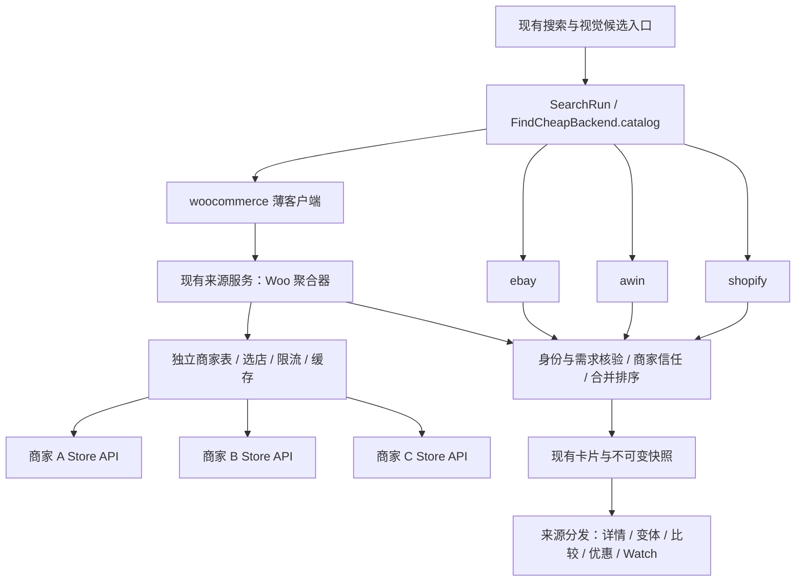

# WooCommerce 独立商品来源接入计划

日期：2026-09-08。核对基线：本地 `main`，FindCheap `0.17.34`，HEAD `6fd99b61fa435ac293e173a478b700f87db7d396`。

状态：2026-09-08 用户以“按这个开始做，全部做完吧”批准实施，按方案 B 冻结。后续实现与验证见[实施记录](../engineering/changes/2026-09-08-woocommerce-independent-source.md)。以下保留批准时的设计与验收门槛。用户已明确来源定位：WooCommerce 与 Shopify Global Catalog 同级，作为现有来源之外的独立搜索来源。本文不表示代码完成、商家实测通过或已获得提交、部署、安装授权。

## 1. 目标与实现边界

在 `FindCheapBackend.catalog` 增加 `woocommerce`。用户继续调用现有 `search_products`；WooCommerce 与 Shopify、Awin、已配置 eBay 在首轮并行检索，共用身份核验、需求过滤、比较、排序、卡片和快照机制。

必须支持没有品牌的品类搜索。例如“100 美元以内的机械键盘”也会检索已接入的 WooCommerce 商家；其他来源已经返回商品不阻止 WooCommerce 参与。已知型号、品牌和已接入商家的商品链接同样适用。

“同级来源”指在 Backend 和用户检索流程中的角色。WooCommerce 的底层接口是每家店的公开商品接口，跨店发现、聚合与覆盖统计由 FindCheap 提供；接通一个接口不自动获得全部 WooCommerce 商家。公开商品读取通常不需要注册 WooCommerce 账户或平台 API key，具体商家仍可能关闭接口或限制访问。[官方 Store API 说明](https://developer.woocommerce.com/docs/apis/store-api/)

完整交付包括：搜索、商品和变体读取、混合来源比较、已选商品优惠衔接、现有视觉候选流程、明确授权后的商品价和库存 Watch。首版支持普通 simple / variable 商品及 USD 商品价；其他币种保留原币证据并明确标记暂不参与 USD 价格比较，不能直接套成美分。订阅、组合套装、自定义定价与 external 商品先标记不支持。

Store API 本身包含购物车和结账能力。本接入只使用商品 GET 接口，卡片继续跳商家购买；不增加购物车、下单、支付、账户或订单接口，也不把商品价写成含运费税费的到手价。

## 2. 已确认事实、方案假设、待验证事项

| 类型 | 内容 | 对计划的影响 |
| --- | --- | --- |
| 事实 | [Backend](../../apps/mcp-server/src/backend.ts) 已有 `catalog.shopify / awin / ebay` 和独立 `product` 能力 | 在现有接口增量加端口，不重写 Backend |
| 事实 | [search-products.ts](../../apps/mcp-server/src/search-products.ts) 已首轮并行查询三个商品源，随后受限补搜 | 在同一调度器增加第四个来源 |
| 事实 | 现有来源服务已有 `/v1/ebay/search`，MCP 有对应薄客户端 | 可以沿用已有独立来源的部署结构 |
| 事实 | 已选商品 inspector 和 Watch 观察器部分绑定 Shopify | 搜索接通后还必须补来源分发，才算完整接入 |
| 事实 | 现有卡片最多 2／3／3、总计 8 张；已知同款通常 0–3 个 | 增加来源不增加展示组，也不分配固定来源配额 |
| 方案假设 | 复用现有 `awin-feed-service` 运行跨店聚合 | 降低运维增量，但需隔离 Woo 请求预算与缓存 |
| 方案假设 | 首批验证 5–10 家候选，至少 3 家通过、覆盖至少 2 类商品后开放试点 | 数字是上线门槛，不是已经拥有的商家覆盖 |
| 待验证 | 实际商家名单、接口可达性、API 版本、变体字段、配送及价格上下文 | 在 P0 留存逐店证据，失败商家不进入有效覆盖数 |
| 待验证 | 启用后的耗时、命中率、第三方店铺访问限制 | 用真实样本和受控故障验证后调整参数，不把设定值当实测值 |

设计依据：[Agent 总设计](../architecture/agent-design.md)与[研发协议](../engineering/agent-development-protocol.md)。之前“仅作为官网补搜”的建议已被本次用户明确指定的独立来源定位替代。

## 3. 两种可行结构与选定方案

| 方案 | 实现 | 优点 | 代价 |
| --- | --- | --- | --- |
| A：MCP 直接跨店聚合 | `catalog.woocommerce` 在用户设备读取配置商家 | 少一跳服务请求；可快速验证单店客户端 | 各安装分散维护店铺表、限流和缓存；故障定位分散 |
| B：现有来源服务聚合，MCP 通过端口访问 | 在现有服务增加 Woo 路由和店铺注册表 | 共用商家配置、访问预算、短缓存、故障隔离；符合 eBay 现有接法 | 来源服务增加出站流量，需要并发和内存隔离 |

推荐并按 B 展开。两种方案都能实现独立来源；选择 B 是为了集中管理跨店访问。首版不新增独立微服务、不重命名 Awin 工程、不建立全量商品库。



现有官网补搜机制继续使用自己的触发条件。Woo 商家可为品牌官网或零售商，但“已接入 Woo”本身不授予官网、可信商家或综合首选资格。

## 4. 接口合同

以下是拟新增接口，不是当前已存在的实现。共享传输 schema 放在 `packages/contracts/src/woocommerce.ts`；MCP 端口保留 `AbortSignal`，信号不进入 JSON。

```ts
type CatalogBackend = {
  // 保留现有字段。
  woocommerce?: WooCommerceCatalogPort;
};

interface WooCommerceCatalogPort {
  search(input: WooSearchInput, options?: { signal?: AbortSignal }): Promise<WooSearchResult>;
}

interface WooCommerceProductPort {
  lookup(target: WooProductTarget, options?: { signal?: AbortSignal }): Promise<WooProductObservation>;
  inspect(target: WooProductTarget, requirements: WooVariantRequirements,
    options?: { signal?: AbortSignal }): Promise<WooInspectionResult>;
}
// ProductBackend 增加 woocommerceProducts?: WooCommerceProductPort。
```

### 4.1 服务端路由

| 拟新增路由 | 请求和作用 | 上游实际操作 |
| --- | --- | --- |
| `POST /v1/woocommerce/search` | 查询词、已解析约束、市场/币种、结果上限、预算、补搜上下文 | 对选中的商家执行产品列表 GET |
| `POST /v1/woocommerce/products/lookup` | 注册商家 ID、商品 ID、可选变体 ID，或经过注册表验证的商品链接 | 按 ID 读取当前商品事实 |
| `POST /v1/woocommerce/products/variants` | 已核验父商品及颜色/尺寸等要求 | 读取、匹配并核验子变体 |
| `GET /v1/woocommerce/images` | 注册商家 ID 与服务端签发或保存的图片引用 | 读取已批准图片域名下的商品图片 |

内部 POST 是查询请求的传输方式；上游只发送 GET。复用服务现有请求体限制和入口限流，新增 Woo 专属并发预算、响应 schema 与类型化错误。客户端断开或取消时，服务取消对应的全部商家请求。

单店读取示例（域名和 ID 为占位示例）：

```text
GET https://merchant.example/wp-json/wc/store/v1/products?search=keyboard&per_page=20
GET https://merchant.example/wp-json/wc/store/v1/products/123
GET https://merchant.example/wp-json/wc/store/v1/products?type=variation&parent=123
```

API 基地址由配置给定，禁止请求体指定任意源站。商品链接必须解析到注册商家，校验路径/别名后转换为内部目标。图片路由不接受任意 URL，不能成为公开代理。

### 4.2 搜索输入、结果与覆盖

- 输入保留用户原始身份和硬条件；`retrieval-plan.ts` 只为 Woo 编译召回词，不回写用户约束。商家分类 ID、属性 slug 等只能使用该商家经过验证的映射；缺少映射时采用文本召回和本地核验。
- 查询结果明确 `source: WOOCOMMERCE_STORE_API`、`schemaVersion`、`registryVersion`、`requestId`、商品及逐店结果。拟定状态为 `COMPLETE / PARTIAL / UNAVAILABLE / NOT_CONFIGURED`；关闭来源走未配置分支并记录具体原因。
- 覆盖字段包含可选商家数、计划商家数、实际尝试数、成功/失败/跳过数、分页或变体截断、缓存命中、物理 HTTP 次数和耗时。`COMPLETE` 仅表示本轮受限计划完成；另列 `registryCoverageComplete`，不等于全网覆盖。
- 全部商家成功但无匹配商品才是有效零结果；部分失败返回 `PARTIAL`，全部失败返回 `UNAVAILABLE`。禁用、限流、超时、未配置均不能变成“该商品不存在”。
- 第二轮延用同一 `registryVersion` 和已经尝试的商家/页信息；该上下文由服务结果和 SearchRun 保存，不能由模型任意扩充商家列表。商家 ID 仍逐个经过服务器校验并受同样预算约束。

### 4.3 商品身份与价格合同

| 字段组 | 规则 |
| --- | --- |
| 来源身份 | `sourceKind`、内部 `merchantId`、核验域名、`productId`、可选 `parentProductId / variationId`；SKU 只在店内解释 |
| 内部引用 | 代码按来源＋商家＋父商品/商品＋变体生成稳定 key；不复用 Shopify handle、variant ID 或 Awin product ID 命名空间 |
| 商品身份 | 标题、品牌、型号、GTIN/MPN（确有返回或证据才填）、货况、包装数量及规格维度；未知保持未知 |
| 价格 | 保留原始币种/最小单位/金额字符串和观察时间；USD 金额转换为整数 cents；缺失、非法或溢出值不能转为 0 |
| 价格范围 | 父商品起价/区间只能作为范围证据；有明确变体要求时，必须获得对应子变体的真实金额才能进入精确报价卡 |
| 库存 | 区分父级和变体级事实、现货/缺货/可延期交付/未知；父商品有货不能证明指定尺寸有货 |
| 评分 | 保留评分量表、评价数量、所属商品与来源；父商品评分不能描述成该变体独立评分，商品评分不能冒充商家评分 |
| 链接与图片 | 保留经验证的商品及变体链接；图片转为受限引用；不要求 Woo 使用 Shopify `/products/` 路径 |
| 事实来源 | 同一条价格、库存、变体观察原子保存；记录 `checkedAt` 和缓存年龄，读缓存不能把旧观察时间更新成现在 |

Woo 的商品列表、单品、变体和最小货币单位规则以[官方 Products API](https://developer.woocommerce.com/docs/apis/store-api/resources-endpoints/products/)为依据。各店部署版本与扩展可能不同，P0 验证能力后才启用对应参数。详情 HTML 作为不可信数据清理，不能影响工具指令。

## 5. 商家注册与跨店聚合

### 5.1 独立商家表

新增 `apps/awin-feed-service/src/woocommerce-registry.ts`。不把零售商塞入 `OfficialStorefrontRegistry`，也不为此扩展它的严格平台枚举，避免影响旧客户端读取官方店表。

每条记录至少包括：内部 ID、显示名称、HTTPS origin、WordPress/Store API 基路径、经审核的别名和图片域名、分类/品牌提示、市场与币种证据、API 能力及核验日期、访问状态、配置版本。访问状态与商家信任分开：API 可访问不代表商家已可信；USD 不代表美国商家或已证明配送美国。

纳入流程：发现候选 → 检查公开接口与访问限制 → 验证普通商品及变体样本 → 建立链接/图片和分类映射 → 加入可访问表 → 独立核验商家及配送证据 → 用现有规则决定哪些结果可以展示。首批应同时包含品牌店与零售商。失败或过期能力保留诊断，不计入可用覆盖。

维护职责归 FindCheap 来源维护流程：配置变更带证据和版本；故障可自动短暂熔断，但恢复访问不自动修改商家信任。首版不创建周期爬虫或额外定时任务。

### 5.2 路由和请求预算

已知链接直接定位商家；明确品牌用品牌/品类提示缩小范围，同时允许相关零售商；无品牌按商品大类选店。提示缺失只降低优先级，不直接认定不卖该商品。选店与排序不参考佣金高低。

以下为待压测的首版默认上限，实施时通过配置和断言落实，不是实测性能承诺：

| 项目 | 默认值/约束 |
| --- | --- |
| 每轮店铺数 | 最多 6 家；两轮优先覆盖未尝试的相关商家，确需改写查询可重查并记账 |
| 召回与输出 | 每店每页最多 20 个父商品，最多 2 页；返回默认 12 个候选、最大 24 个；实际请求以总预算为准 |
| 并发 | 单搜索同时 3 家、同店 1 个请求；服务进程最多 12 个 Woo HTTP、同店跨用户最多 2 个 |
| 超时 | 单次 GET 3 秒；一次聚合至多 8 秒，始终小于调用方剩余时间，预留返回和清理时间 |
| 物理请求预算 | 单聚合至多 18 个 HTTP，分页、详情、变体、重试全部计入；一个 SearchRun 最多两次 Woo 搜索、合计至多 36 个 |
| 重试 | 每店最多 1 次、每次聚合总计最多 2 次；仅瞬时故障且预算允许时重试；429 尊重 Retry-After，等不及则返回部分结果 |
| 响应限制 | 单 HTTP 解压后最多 1 MiB、单聚合总计 8 MiB；流式计数并限制解析深度/数组长度 |
| 熔断 | 建议连续 3 次瞬时故障后暂停该店 5 分钟，半开仅 1 个探测；拒绝访问/安全失败不自动换域绕过 |
| 短缓存 | 搜索 60 秒、详情/变体 30 秒；键含完整查询、条件、市场/币种/语言和表版本；总计最多 24 MiB、2,000 项 LRU |

父商品先轻量筛选，再对最相关候选核验变体；预算不足标记未核验/截断，不能使用父级最低价填补。二轮是否启动由现有“需求尚未完成”的判据决定，不限制为其他来源零结果时才启动。

SearchRun 现有 16 次 catalog read、30 秒 active、90 秒 service 预算保持不变。Woo 首轮占一个来源调用额度，补搜前先检查剩余额度及已计划的其他来源/变体核验；不能耗尽既有必要核验的预算。一次来源调用与内部物理 HTTP 分别记录、分别限额；详情/Watch 独立操作也需同样的超时、取消与物理请求上限。启用多服务副本前必须重新落实跨副本限流，不能把单进程上限称为全局上限。

上述 GET 限额是 FindCheap 自己的访问策略。Woo 官方文档中的可选 Store API 限流目前主要约束 POST；不能把它当作各商家商品 GET 的统一额度，各站 WAF 或主机仍可能另外限流。[官方限流说明](https://developer.woocommerce.com/docs/apis/store-api/rate-limiting/)

不复用 Awin feed archive 的 `source-cache.ts` 保存 Woo 查询。短缓存故障可退回有预算的实时读取；上游失败时不把过期价刷新成当前价。商家数量扩大后，以覆盖不足率和命中/耗时证据决定是否单独建设轻量商品索引，不能无限增加单次跨店 fan-out。

## 6. MCP 内的完整接线

| 层 | 主要文件/新增模块 | 改动 |
| --- | --- | --- |
| 端口与装配 | `backend.ts`、`stdio.ts`、新增 `woocommerce-client.ts` | 装配可选 catalog/product 端口；未配置不阻止现有来源启动 |
| 查询与调度 | `retrieval-plan.ts`、`search-products.ts`、`search-run.ts` | 增加来源枚举、首轮并行查询、受限补搜、取消和请求账本 |
| 错误与覆盖 | `source-failure.ts`、来源诊断和 tool outcome schema | 保留逐店失败及来源状态；统计以最终有效结果为准 |
| 候选类型 | `UnifiedCandidate`、共享合同及 `server.ts` 对外 schema | 独立 Woo DTO 分支，不伪装成 Shopify 商品 |
| 引用与快照 | `product-reference.ts`、`server.ts` | 新增来源明确的商品索引，完成资格过滤后才生成卡片引用 |
| 同款去重 | `offer-equivalence.ts` | 支持 Woo 商品/变体 URL；跨来源同店同 offer 需明确等价证据 |
| 详情分发 | 新增来源分发模块及 Woo inspector，保留 `shopify-selected-product.ts` | 根据已锁定快照来源选择读取器，不用 Shopify `.js` 请求 Woo 商品 |
| 显示与报价 | `product-card-ui.ts`、摘要及 quote 资格判定 | 显示 Woo 来源和商品价；标记 MERCHANT checkout，不授予 Shopify cart quote |
| 视觉 | `visual-source-fingerprints.ts`、`visual-candidate-images.ts` | Woo 进入现有候选证据与图像核验；使用受限图片服务 |
| Watch | `watch-service.ts`、`watch-store.ts`、相关工具及 stdio 装配 | 按来源读取被选商品，增加兼容持久化与故障语义 |

### 6.1 不可变快照与选择

当前部分后续工具从 Shopify 形状的 `sourceResult.products` 取原商品。增加一个小型 `SnapshotSourceProductIndex`，按统一 product reference 保存带来源判别的原始商品 DTO；保留原 Shopify 数据及报价适配器供既有消费者使用，不一次重命名全仓类型。

详情、比较、优惠和 Watch 先验证原 `renderId / selectionId`、选择修订及所属快照，再通过索引分发。不能猜测当前最新快照、回退第一张卡或通过相同数字 ID 跨商家取商品。刷新/变体检查生成子快照，旧快照和旧价格保持不变，未检查商品及选择上下文按既有规则保留。

新增通用 `inspect_selected_product` 名称，旧 `inspect_selected_shopify_product` 保留为兼容别名并共用选择校验/分发逻辑；同步 capability 映射与购物 skill。仍只使用现有搜索入口，不新增要求用户手动调用的 Woo 专用搜索工具。`PRODUCT_INSPECTION` 能力同时考虑 Woo inspector；是否可查某件商品由该来源实际能力再次检查。

### 6.2 核验、排序与去重

沿用硬条件、货况、同款身份、变体、包装数量、商家和价格证据规则。商品评分沿用当前第二层 `>3.8/5` 且至少 2 条评价门槛及真实来源要求，不提升商家独立信任；无法证明配送要求时按现有要求域处理。

四来源候选进入同一排序池，不设置 Woo 保底卡位，也不增加第四展示层。同店 Woo 与 Awin 返回相同商品时，只有规范链接、商品身份及变体都可证明相同才合并，保留来源观察；不能仅凭标题或价格相同去重。选择一个完整有效观察作为当前报价，不拼接 A 来源低价与 B 来源库存。不同商家的同款保留为可比较的独立 offer。

### 6.3 后续能力矩阵

| 用户动作 | Woo 交付行为 | 必须避免的断点 |
| --- | --- | --- |
| 品类/型号搜索 | 首轮参与，多店召回，与现有来源统一过滤排序 | 必须先出现品牌或其他来源失败才查 Woo |
| 已知商品链接 | 在已注册域名定位商品，锁定身份与变体 | 任意域名直连，或把无法定位当作商品不存在 |
| 查看颜色/尺寸/价格 | 按父子关系检查具体变体并返回新观察 | 父商品起价冒充指定变体价 |
| 选择 2–4 件比较 | 可混选 Woo、Shopify、Awin、eBay，证据缺失明确展示 | Woo 卡片能显示但没有可解析的后续商品引用 |
| 已选商品优惠 | 用明确商家身份衔接现有 DealPort；需要当前价格时先按 Woo 目标刷新 | 把 Woo ID 当成 Awin ID，或把 `on_sale` 当可用优惠码 |
| 图片搜索 | 现有图片理解产生查询后可召回 Woo；返回图片参加既有视觉核验 | 声称 Woo 提供原生图片搜索，或把用户原图发送给各商家 |
| 商品价/库存 Watch | 明确授权后绑定来源、商家及商品/变体 ID；按目标读取 | 每轮重新搜索并换商品，或 Woo 请求误走 Shopify |
| 运税/到手价 | 明确未获得报价能力，保留缺失状态 | 自动创建购物车、把缺失费用记作 0 |

优惠和 affiliate 关系是另外的已有能力。Woo 接通本身不产生商家联盟批准、佣金、现金返还或可验证优惠；只有已有明确商家映射与证据时才展示。

### 6.4 Watch 的存储与回滚

现有持久化 selectedProduct schema 只接受 Shopify，目录扫描遇到不兼容记录可失败。采用小范围兼容方案：旧记录格式和文件名不改；新 Woo 记录使用独立后缀 `<watchId>.woocommerce-v1.json`，对应停止/删除意图也采用独立后缀。新 store 在同一锁和总容量约束下读取两类记录，校验 ID 唯一与内容来源；旧版的文件名匹配不会读入 Woo 格式。不得往旧格式强塞新来源后期待旧客户端忽略字段。

商品观察器按存储的来源目标分发，价格/库存只比较同一商品及变体。未选定变体不能创建声称监控指定 SKU 的规则。API 失败、来源暂停或商品身份不明产生未完成观察，不能发出降至 0 元、补货或涨价通知。

上线前验证新旧记录共存、重启恢复、去重、容量、删除及待停止意图。回退旧插件前由新版停止已绑定的 Woo 宿主自动化并验证状态，保留规则和历史供恢复；不让旧插件继续调度它无法理解的目标。仅关闭 Woo 来源时，新版保留规则但返回来源不可用。本计划不创建任何监控；实际启用仍依用户原有明确授权和宿主绑定规则。

## 7. 安全、故障与运行观测

源站与图片访问复用或提取现有安全 GET 底层能力：HTTPS、受控端口、DNS/IP 校验、私网拒绝、重定向逐跳校验、超时/字节限制、AbortSignal。商家批准访问域名与商家可信度是两套判定。不能为了代理图片而把零售商注册成官网，也不把 UI CSP 放宽为任意域名。

| 情况 | 处理 | 对用户结果的影响 |
| --- | --- | --- |
| 某店超时/429/网络瞬断 | 受限重试或冷却，保留逐店状态 | 其他店和其他来源继续；覆盖为部分完成 |
| 403、WAF 拒绝、安全目标失败 | 不绕过访问控制，记录类型化原因 | 该店不可用，不声称没有商品 |
| 返回 HTML/非法 JSON/schema 不符 | 终止该次解析，记录兼容性失败 | 不转成空列表或商品描述 |
| 变体关系/价格/币种不明 | 降为未核验候选或排除精确报价 | 不补猜最低价、汇率或库存 |
| Woo 整体关闭/故障 | 可选端口失效，其他源按原逻辑工作 | 明确来源状态，不使 Awin/全服务 readiness 随之失败 |
| 缓存或表版本变化 | 按版本隔离，过期不伪装实时；禁用优先于缓存命中 | 不继续展示被撤销访问的实时可用性 |
| 请求取消/预算耗尽 | 取消排队和在途 Woo 请求，报告实际覆盖 | 不无限后台补查，不延长宿主预算 |

记录每来源和每商家的请求数、成功率、延迟、返回/合格/最终展示数量、缓存年龄、变体失败、限流及熔断。日志只记录必要查询诊断，不收集商家账户、购物车或用户支付信息。现有服务 readiness 不要求所有 Woo 商家同时可用；单独提供 Woo 配置和运行摘要。

## 8. 原子实施顺序与每步退出条件

构建命令已在本仓库脚本核对：`pnpm build:awin-feed` 构建来源服务，`pnpm build:mcp` 构建分发插件。下表短记为 **B源 / B端**。测试路径均为现有目录；含 `woocommerce` 的新文件名是拟新增测试。执行单测使用 `pnpm exec vitest run <测试文件>`。

每一步只合入该步最小行为增量，立即执行所列构建和断言；失败修复本步后重跑，不推进下游。如果实测改变合同或业务假设，返回 P0/P1 更新受影响计划。未接线模块先提供可构建的可选接口，不用一次性大改绕过中间构建失败。

| 步骤/依赖 | 模块与最小行为增量 | 构建及测试 seam | 通过标准 |
| --- | --- | --- | --- |
| P0 / 无 | 选定首批商家，记录普通/变体/异常样本与能力；固定覆盖和性能基线 | 只读采样；文档结构和样本脱敏检查，B 不适用 | 候选逐店有结果；至少 3 家可用于试点，否则保留实现计划但不宣称可上线 |
| P1 / P0 | 共享 Woo schema、端口类型、最小商品及状态合同 | B源＋B端；`apps/mcp-server/test/woocommerce-contract.test.ts`，从共享合同导入 | 固定合法样本通过；跨店目标、非法币种单位/金额、无界数组被拒绝；既有合同兼容 |
| P2 / P1 | 独立注册表、目标解析与安全 GET 边界 | B源；`apps/awin-feed-service/test/woocommerce-registry.test.ts` | 已批准域名解析成功；未知域名、私网、越界重定向、伪造图片引用失败 |
| P3 / P2 | 单店列表和按 ID 读取、字段归一化 | B源；`apps/awin-feed-service/test/woocommerce-store.test.ts` | 固定 `1099` USD/2 → 1099 cents；缺价不为 0；父范围/库存作用域保留；非 USD 不误标 USD |
| P4 / P3 | 子变体读取与属性匹配 | B源；`apps/awin-feed-service/test/woocommerce-variants.test.ts` | 两颜色两尺码样本只取指定变体；父子不符、缺货、分页截断、定制类型不能伪造完整命中 |
| P5 / P4 | 跨店选店、并发、缓存、预算与部分失败 | B源；`apps/awin-feed-service/test/woocommerce-search.test.ts`，假时钟＋受控 HTTP | 无品牌查询访问多店；一店失败其余保留；全部失败状态正确；物理请求/重试/字节/时间上限可断言 |
| P6 / P5 | 三条 JSON 路由、取消传播和图片代理；配置默认为关 | B源；扩展 `apps/awin-feed-service/test/service.test.ts`＋新增 Woo HTTP 测试 | 方法/体积/目标校验正确；断连取消请求；图片 MIME 校验；旧 eBay/Awin 路由与 readiness 不退化 |
| P7 / P6 | MCP Woo 客户端与可选 Backend 装配 | B端；`apps/mcp-server/test/woocommerce-client.test.ts`、`backend.test.ts` | 配置关闭无请求；合法响应解析成功；超时和不兼容响应保留来源失败；仅 Woo inspector 也正确报告可检查能力 |
| P8 / P7 | 查询枚举、候选分支、首轮调度、账本及最终搜索响应 | B端；`search-products.test.ts`、`retrieval-plan.test.ts`、新增 Woo 搜索合同测试 | 延迟可控的四个来源均在首轮启动；Shopify 有结果仍调用 Woo；关闭 Woo 与旧基线一致；部分结果不报无商品 |
| P9 / P8 | 来源商品索引、引用、混合比较、去重和卡片报价资格 | B端；`product-reference.test.ts`＋新增 Woo 选择/比较测试 | 两店相同数字 ID 不串货；同店跨源只有可证明同变体才合并；四源混选可比较；Woo 永不进入 Shopify cart quote |
| P10 / P9 | 通用 inspector、兼容别名、优惠分发与 skill | B端；新增 Woo inspector 测试＋`deal-selection-contract.test.ts`、`execution-contract.test.ts` | 已锁定选择不随 UI 改选漂移；检查返回子快照且父快照不变；旧工具可用；无 merchant/program 映射不伪造优惠 |
| P11 / P9 | Woo 视觉指纹、候选图片及 CSP 接线 | B端；视觉来源/图片合同测试，必要时 B源 | 新来源图片可加载并参与原视觉流程；未知图片源拒绝；失图不视作图像不匹配；原图不发给商家 |
| P12 / P10 | Woo Watch 目标、文件后缀兼容、观察器及宿主结果衔接 | B端；`watch-service.test.ts`＋新增 Woo Watch 持久化/宿主合同测试 | 只刷新已选 ID；失败不触发价/库存通知；重启/旧记录/停止意图保留；未授权不建规则；实际宿主绑定另行验收 |
| P13 / P10、P11、P12 | 更新设计实现状态、配置文档和完整验证证据 | 两构建、typecheck、lint、全测、stdio；受影响 integration 测试；`git diff --check` | 自动门槛全绿，真实商家和原生宿主验收分别有结论；否则不标完整接入 |
| P14 / P13，且有相应发布授权 | 按下一节顺序发布、验证与回滚演练 | 版本、源服务、插件安装及宿主冒烟分别留证据 | 线上有效来源及后续操作有证据；不是只证明构建成功 |

P0 只读商家研究可推进；尚未取得的真实覆盖不能用 fixture 代替。P11 与 P10 没有数据迁移依赖，可独立完成，但默认仍按小步执行，无需新增多 Agent 运行结构。

## 9. 验收样本与完整完成标准

开发前固定一套 40 项业务样本：18 项品类搜索、10 项已知产品、8 项变体/包装场景、4 项明确负例。每项写明用户原要求、应查来源、允许候选、禁止结果和预期后续动作；自动测试预期来自固定业务证据，不能复用被测算法生成答案。另有故障矩阵，不计入这 40 项分母。

必选自动门槛：

1. 符合配置与预算的无品牌请求会首轮查询 Woo；不依赖 Shopify/Awin 为空。
2. 已知产品不混型号、代际、颜色、尺寸、货况、包装；全部精确负例被拒绝，关键身份和错价断言必须 100% 通过。
3. 四来源共同排序但无硬塞卡片；展示数、来源计数和快照索引与最终有效卡片一致。
4. merchant/product/variant 数字碰撞、外来选择、过期引用、途中改选均不串对象；Woo 卡片可完整进入检查、比较、优惠和 Watch 的正确路径。
5. 多店并发、429、超时、全失败、取消、缓存过期、响应过大及恶意目标均有独立预期断言；其他源回归通过。
6. 旧插件不读取 Woo Watch 文件；新版能管理两类记录，停止意图、原子写入、重复规则和全局容量正确。

真实验收门槛：至少 3 家真实可用商家、至少 2 个品类，核对源站商品/实际变体/当前商品价；同一会话走完“搜索 → 选中 → 检查 → 混合比较 → 查询优惠”。图片流程在原生 Codex 宿主验证加载与上下文；Watch 使用明确授权的测试规则验证宿主绑定、执行、重启和停止，未授权时只测试无副作用路径。

性能验收先跑同一环境的关闭/开启对照：每次聚合在有效预算内退出，其他来源不会等待 Woo 完成后才开始；记录端到端 p50/p95 和超时率。试点目标为 p95 增量不超过 2 秒，但这是待测目标，不能靠降低身份标准达成；未达标先调整选店、查询和缓存，不盲目提高全局超时。

完整命令基线：`pnpm typecheck`、`pnpm lint`、`pnpm build:mcp`、`pnpm build:awin-feed`、`pnpm test`、`pnpm test:mcp-stdio`、`git diff --check`。默认 `pnpm test` 不覆盖 integration 套件；HTTP/持久化等受影响集成场景要按 `vitest.integration.ts` 明确运行范围并记录所需环境，缺环境记 BLOCKED，不计 PASS。本次文档没有运行这些代码验收。

## 10. 配置、发布与回退

拟新增配置：来源服务 `WOOCOMMERCE_SOURCE_ENABLED=false` 及经过校验的预算选项；MCP `WOOCOMMERCE_API_BASE_URL` 指向固定受信来源服务。店铺注册表和访问策略保留在服务端。商家公开 GET 不需要密钥；若以后商家要求授权，只能另立接入合同，不能把管理 API 密钥打包到插件。

发布顺序：

1. 先发布向后兼容的来源服务路由和表，Woo 开关关闭；旧 Awin/eBay/官网注册表响应不变。
2. 在受控配置开启少量经过验证商家，执行服务只读冒烟；不可用源不拖垮现有服务。
3. 发布包含新来源 schema、端口、快照和后续操作的插件版本，同步通用检查工具、skill 和必要 UI resource 版本。
4. 内部试点再扩大注册表，分别记录实际商家覆盖、来源有效候选率及最终展示率；不能把配置条数当可用商家数。
5. 分开核对源码版本/提交、服务部署版本、安装插件启用状态、源与安装包 hash、stdio 及真实宿主结果。只有相应授权到位才执行提交、推送、部署或替换缓存。

回退优先关闭 Woo 调用和服务开关，保留已产生的历史快照与证据；现有三来源继续运行。新版 Watch 对暂停来源报告不可用，不产生价格或库存提醒。若必须回退旧插件，先用新版停止 Woo 宿主任务并核验停止，再降级；保留独立后缀记录供重新升级。商家访问撤销必须先于缓存命中检查。

本次交付是上述计划文档。接入完成的定义是独立来源在现有搜索和后续动作中全部闭环，自动断言与真实验收分别通过；仅增加一个 HTTP client 或只在搜索列表看到 Woo 商品，不能宣布完成。

## 11. 实施工期估算

以一名熟悉当前仓库的工程师为假设：商家验证与合同约 1–2 个工作日；单店/变体/聚合及 HTTP 服务约 2–3 日；MCP 搜索、快照、检查/比较/优惠/图片约 2–3 日；Watch 兼容、全回归及宿主验收约 2–3 日。完整工作估算约 7–11 个工作日，商家访问限制或宿主问题单独记录，不用删减完整链路掩盖延期。

先用 P0–P8 得到可验证的独立来源搜索里程碑，再完成 P9–P13 的后续操作和验收；中间里程碑明确标注能力范围。最需要尽早确认的工程事实是首批有效商家及变体质量，Backend 的扩展接口本身已经存在。
