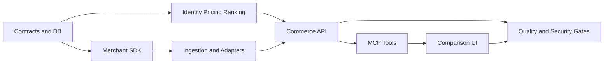

# AI Transaction Agent MVP Master Implementation Plan

> **For agentic workers:** REQUIRED SUB-SKILL: Use superpowers:subagent-driven-development (recommended) or superpowers:executing-plans to implement this plan task-by-task. Steps use checkbox (`- [ ]`) syntax for tracking.

**Goal:** 在 16–20 周内交付面向美国用户、覆盖首批 10–20 家美国主流商家的 ChatGPT 同款比价受控 Beta。

**Architecture:** TypeScript monorepo承载 Commerce Core、商家接入、MCP Server 和动态卡片；PostgreSQL 保存规范商品、Offer、报价与证据，Redis/BullMQ 处理刷新任务。Crawl4AI 作为独立 Python 容器，仅在允许域名的后台异步采集中兜底。

**Tech Stack:** Node.js 22 LTS、TypeScript strict、pnpm workspace、Fastify 5、Zod、PostgreSQL 17、Redis 7.4、BullMQ、React 18、Vite、Vitest、Playwright、Python 3.12、pytest、Docker Compose、Crawl4AI 固定审核版本。

## Global Constraints

- 市场仅限美国消费者和美国商家。
- 第一阶段仅限 10–20 家已通过质量门的主流商家，不做全网泛搜。
- 支持入选商家站内全部零售商品类型；不保证每个 SKU 都能跨店精确匹配。
- 只有 GTIN/UPC/EAN 一致，或品牌 + 制造商 MPN 一致，且关键变体一致，才可标记精确同款。
- 相似款必须独立展示，不进入同款价格排序。
- 同时展示普通价与会员价；只有用户声明已有资格的会员价进入默认排序。
- Cashback、积分和未来返利不得计入到手价。
- Affiliate 佣金不得进入排序特征；披露必须贴近外跳按钮。
- Crawl4AI 不得进入同步必经路径，不得接收任意 URL 或任意 JavaScript。
- 不做自动下单、支付、钱包、返现结算、机票、酒店或预约。
- TypeScript 必须启用 `strict`、`noUncheckedIndexedAccess` 和 `exactOptionalPropertyTypes`。
- 所有业务金额使用整数美分；所有时间使用 UTC ISO 8601；所有外部输入先经 Zod 校验。
- 每个业务任务遵循 red → green → refactor；每个任务独立提交。

---

## 计划拆分

按依赖顺序执行：

1. [Commerce Foundation Plan](./2026-08-13-commerce-foundation-implementation.md)
2. [Merchant Data Plane Plan](./2026-08-13-merchant-data-plane-implementation.md)
3. [ChatGPT Shopping App Plan](./2026-08-13-chatgpt-shopping-app-implementation.md)
4. [Beta Hardening Plan](./2026-08-13-beta-hardening-implementation.md)

每份计划产生可独立测试的软件增量。Commerce Foundation 是其余计划的硬依赖；Merchant Data Plane 与 ChatGPT App 在合同稳定后可部分并行；Beta Hardening 在端到端路径可运行后开始。

## 目标仓库结构

```text
shopping-agent/
  apps/
    commerce-api/          # 查询、报价、偏好和内部管理 HTTP API
    ingestion-worker/      # BullMQ 商家刷新与证据处理
    mcp-server/            # ChatGPT MCP 工具与 UI resource
    plugin-ui/             # React 动态比较卡片
  packages/
    contracts/             # 跨进程 Zod schema 和 TypeScript 类型
    db/                    # SQL migrations、repository 和事务
    product-identity/      # 标准化、精确/待确认/相似判定
    pricing/               # 到手价、会员与 Coupon 计算
    ranking/               # 无佣金排序
    merchant-sdk/          # MerchantAdapter 合同和测试套件
    merchant-adapters/     # 入选商家适配器
    observability/         # 日志、指标、trace、健康检查
    test-kit/              # fixture、fake clock、Gold Set helpers
  services/
    crawl4ai-worker/       # 隔离 Python 动态采集服务
  config/
    merchants/             # 候选评分、域名白名单、功能开关
  data/
    gold-set/              # 500+ 人工验证样本及版本信息
  infra/
    docker/                # 本地依赖与 crawler 网络限制
    migrations/            # PostgreSQL migration SQL
    runbooks/              # 故障、回滚、隐私删除、Beta 值班
  tests/
    contract/              # Adapter 和 MCP 合同测试
    e2e/                   # 用户旅程与价格验证
    security/              # SSRF、重定向、Prompt Injection
    load/                  # P95 与容量测试
  docs/
    product/               # 用户文案、披露、商家接入决策记录
    superpowers/           # 设计规格和实施计划
```

## 依赖图



## Sprint 路线图

| 周期 | 主要交付 | 必须通过的门 |
|---|---|---|
| Sprint 0，周 1–2 | 商家审计、Affiliate 申请、Gold Set 规范、数据源 PoC | 至少 6 家可用主路径，4 家明确备选路径 |
| Sprint 1，周 3–4 | Monorepo、合同、数据库、商品身份 | 同款误报基线可测，核心 schema 固定 |
| Sprint 2，周 5–6 | Price Engine、Ranking、Commerce API | 固定 fixture 端到端比价通过 |
| Sprint 3，周 7–8 | Merchant SDK、Feed/API、JSON-LD、HTTP ingest | 3 家参考适配器通过合同测试 |
| Sprint 4，周 9–10 | 第一波 10 家、缓存、刷新、证据链 | 10 家通过质量门，主要品类可查询 |
| Sprint 5，周 11–12 | 第二波扩展、Crawl4AI 限定兜底 | 动态采集隔离与 SSRF 测试通过 |
| Sprint 6，周 13–14 | MCP 工具、用户偏好、OAuth | 无 UI 时完整对话流程可用 |
| Sprint 7，周 15–16 | 动态卡片、Affiliate 跳转、披露 | 卡片、降级和删除流程 E2E 通过 |
| Sprint 8，周 17–18 | 安全、负载、结账抽样、故障演练 | 无 Critical/High；P95 与准确率达标 |
| Sprint 9，周 19–20 | 受控 Beta、审核资料、两周质量观察 | 满足设计规格第 18 节公开 Beta 门槛 |

Sprint 5 和 Sprint 9 可根据商家审批与质量提前结束；16 周是理想路径，20 周包含接入和审核缓冲。

## 决策门

### Gate A：商家进入开发

`config/merchants/catalog.yaml` 中必须同时满足：

- `legal_review: approved`
- `affiliate_status` 为 `approved` 或允许普通链接降级
- 至少一种合规数据源为 `proven`
- 身份字段完整度抽样 ≥ 90%
- 无必须绕过登录/CAPTCHA 的路径

### Gate B：商家进入结果集

- Adapter 契约测试 100% 通过。
- 最近 7 天采集成功率 ≥ 98%。
- 必填字段完整率 ≥ 95%。
- 结账抽样价格准确率达到内部 Alpha 线。
- feature flag、熔断和 kill switch 已验证。

### Gate C：受控 Beta

- 精确同款 Precision ≥ 98%。
- 已验证到手价抽样准确率 ≥ 95%，偏差不超过 ±$1 或 ±1%（取较大值）。
- 跳转成功率 ≥ 99.5%。
- 缓存/API 主路径 P95 ≤ 8 秒。
- 支持范围内至少两个精确 Offer 的请求占比 ≥ 60%。

## 团队与责任

| 角色 | 主要责任 |
|---|---|
| Product Lead | 范围、商家选择、Gold Set 仲裁、Beta 指标 |
| Backend/Data A | contracts、DB、Commerce API、Pricing |
| Backend/Data B | Merchant SDK、ingestion、adapters、crawler |
| AI/Search | 属性规范化、匹配规则、评测与误报分析 |
| Full-stack | MCP、OAuth、动态卡片、Affiliate redirect |
| QA/Security/DevOps | CI、可观测性、安全、负载、发布与回滚 |
| Legal/Privacy/Affiliate | 商家条款、FTC 披露、隐私政策、联盟审批 |

## 项目级完成定义

- 四份子计划所有任务完成，测试命令零失败。
- `data/gold-set` 至少 500 个已审核样本。
- 至少 10 家商家通过 Gate B；扩展至 20 家不改变核心合同。
- 无 UI 的 MCP 工具和有 UI 的动态卡片都能完成同一比价流程。
- 用户可保存、修改和删除 ZIP/会员偏好。
- 报价状态、证据、检查时间、普通价和会员价可解释。
- Affiliate 失败可降级普通链接，佣金不影响排序。
- Crawl4AI 关闭时主系统仍可运行；仅对应商家动态兜底能力降级。
- 安全、隐私、FTC 披露、ChatGPT 审核资料和运维手册齐全。

## 参考基线

- Node.js 生产环境应使用 LTS 线：[Node.js releases](https://nodejs.org/en/about/previous-releases)
- OpenAI MCP Server 构建：[Build an MCP server](https://developers.openai.com/plugins/build/mcp-server)
- OpenAI MCP UI 分层与桥接：[Add UI to your MCP server](https://developers.openai.com/plugins/build/chatgpt-ui)
- MCP TypeScript SDK：[official TypeScript SDK](https://github.com/modelcontextprotocol/typescript-sdk)
- Fastify LTS：[Fastify LTS](https://fastify.dev/docs/latest/Reference/LTS/)
- 产品设计规格：[2026-08-13-ai-transaction-agent-mvp-design.md](../specs/2026-08-13-ai-transaction-agent-mvp-design.md)
