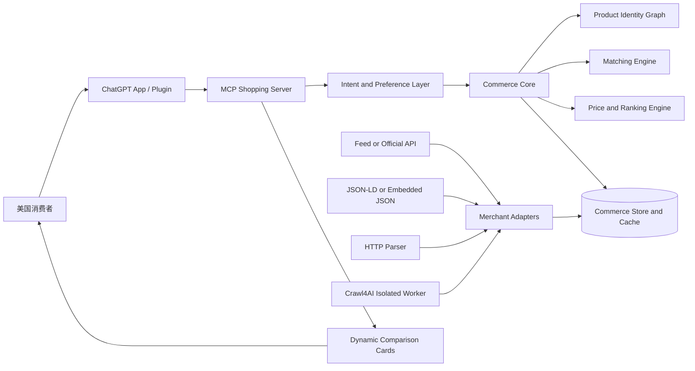

# AI Transaction Agent 第一阶段产品与技术设计

- 日期：2026-08-13
- 状态：设计已确认，待用户最终审阅
- 市场：美国消费者、美国商家
- 首发载体：ChatGPT App / Plugin（MCP 工具 + 动态卡片）

## 1. 执行结论

第一阶段具备较高可行性，但必须严格控制边界：只聚合首批 10–20 个美国主流商家，在这些商家范围内支持全部零售商品类型，完成自然语言找商品、同款识别、真实或明确标注状态的到手价比较、优惠券展示、会员价展示、推荐解释与合规联盟跳转。

产品的核心难点不是聊天界面，而是三件事：

1. 精确确认不同商家的商品是否为同一款、同一变体。
2. 将商品价、优惠券、会员条件、运费、税费和强制费用合成可解释的到手价。
3. 在商家数据源不稳定时保持新鲜度、准确度和合规性。

Crawl4AI 可以缩短少量动态页面的接入时间，但只应作为隔离的异步兜底采集器，不应成为同步查询主链路或产品核心依赖。

## 2. 产品目标

用户用自然语言描述需求后，系统在首批商家范围内返回可信、可解释、可购买的比较结果。

核心用户价值：

- 不用分别打开多个商家页面。
- 明确看到普通用户价格和已有会员时的价格。
- 知道优惠券是否真实可用、需要什么条件。
- 知道为什么推荐某个商家，而不是只看到最低标价。
- 通过合规联盟链接跳转至商家完成购买。

北极星指标：**Verified Comparison Success Rate（已验证比价成功率）**——用户请求中，能够返回至少两个精确同款 Offer，且到手价新鲜、可解释、资格条件明确的比例。

## 3. 第一阶段范围

### 3.1 做什么

- 美国消费者和美国商家。
- 10–20 个主流商家。
- 商家站内全部零售商品类型，不按电子、家居、美妆、服饰等品类设限。
- 自然语言商品搜索和需求理解。
- 商品属性、型号、规格、变体理解。
- 精确同款比较；匹配不确定时询问用户或单列相似款。
- 普通价格、已有会员价格、优惠券、运费、税费、强制费用的解释。
- 用户 ZIP Code 和会员状态的明确授权式收集与保存。
- 动态结果卡片和推荐理由。
- 合规 Affiliate 链接跳转。
- 支撑结果准确性的价格和库存刷新。

“所有商品类型”不等于“所有 SKU 都保证可比”。成功标准是：系统不因品类拒绝查询；但某个 SKU 缺少跨店身份、变体或报价证据时，必须如实降级。

### 3.2 不做什么

- 不做全网泛搜。
- 不承诺所有商品都能精确匹配。
- 不做自动下单、支付或代用户执行交易。
- 不做 Cashback、钱包、资金托管或返现结算。
- 不做机票、酒店、预约等服务交易。
- 不把预测性降价、未到账积分或未来返利计入到手价。
- 不绕过登录、验证码、反爬限制或商家访问控制。

## 4. 产品原则

1. **精确优先于覆盖**：不为提高结果数量制造错误同款。
2. **证据优先于模型猜测**：LLM 负责理解和解释，商品身份与价格必须由结构化证据支持。
3. **总价优先于标价**：推荐依据为资格明确的到手价，而非页面上的最低宣传价。
4. **条件必须显式**：会员、首单、订阅、支付方式、Coupon 门槛必须贴近价格展示。
5. **联盟佣金不影响排序**：排序由价格、匹配置信度、库存、配送和用户偏好决定。
6. **失败时诚实降级**：标注“相似款”“估算”“需验证”或请求补充型号。

## 5. 用户流程

1. 用户输入自然语言，例如：“帮我找 65 英寸 OLED 电视，同款哪个网站到手最便宜？我有 Costco 会员，ZIP 33433。”
2. 意图层抽取产品、品牌/型号、关键规格、变体、预算、ZIP、会员状态等。
3. 如果型号、尺寸、颜色、容量等会影响同款判断且信息不足，先追问。
4. Commerce Core 查询首批商家，规范化商品与 Offer。
5. Matching Engine 将结果分为精确同款、相似款和证据不足。
6. Price Engine 按用户 ZIP、会员资格和优惠券资格计算价格状态。
7. Ranking Engine 只在合格的精确同款 Offer 中排序。
8. ChatGPT 返回比较卡片、推荐理由和联盟披露。
9. 用户点击联盟链接，到商家网站确认并完成购买。

## 6. 动态卡片

每张精确同款卡片至少展示：

- 商品名称、主图、品牌、型号和关键变体。
- “精确同款”状态与证据摘要。
- 普通用户到手价。
- 用户已有会员时的到手价。
- 若用户没有该会员，可展示“会员可享价格”，但不进入默认排序。
- 商品价、折扣、Coupon、运费、税费、强制费用拆分。
- 库存和配送信息。
- 报价状态：已验证、估算或有条件。
- 报价检查时间和数据来源。
- 推荐理由和重要限制。
- “前往商家”按钮及贴近按钮的联盟披露。

相似款必须进入独立区块，视觉上不可与精确同款混排，也不可参与“同款最低价”结论。

建议披露文案：

> 如果你通过这些链接购买，我们可能获得佣金；这不会提高你的购买价格，也不会影响排序。

## 7. 总体架构



主查询链路不实时启动浏览器爬虫。后台采集、缓存刷新和按需报价负责将可验证数据提前准备好；同步路径优先读取新鲜缓存或低延迟官方接口。

## 8. 核心组件

### 8.1 ChatGPT App / Plugin

- 提供 MCP 工具和动态 UI。
- 执行参数校验、用户确认和最小化数据传输。
- 不向模型暴露商家密钥、联盟凭据、内部数据库 ID 或原始抓取页面。

建议 MCP 工具：

- `search_products(query, preferences)`
- `compare_exact_offers(product_ref, zip_code, memberships)`
- `get_offer_details(offer_ref)`
- `set_shopping_preferences(zip_code?, memberships?)`
- `delete_shopping_preferences()`

### 8.2 Commerce Core

- 编排商家查询、缓存、匹配、报价和排序。
- 对模型输出稳定的最小结构化数据。
- 记录每次结果使用的证据版本，支持复核与纠错。

### 8.3 Product Identity Graph

- 维护规范商品、商家商品、变体和标识符之间的关系。
- 通用核心字段加品类扩展属性，保证“所有商品类型”可逐步接入，而不为每个品类建立独立系统。
- 可扩展属性必须保存名称、值、单位、来源和置信度。

### 8.4 Matching Engine

- 规则和证据负责最终同款判定。
- LLM 可用于属性抽取、名称规范化和候选召回，不可单独授予“精确同款”。
- 对高风险或高价值商品可提高证据阈值。

### 8.5 Price Engine

- 根据 ZIP、会员状态、Coupon 条件和商家报价计算到手价。
- 保存每个价格组成项的来源、时间、资格和验证状态。
- 不可获得准确税费时必须标注估算，不得称为已验证真实到手价。

### 8.6 Ranking Engine

默认排序输入仅包括精确同款且价格状态合格的 Offer。建议排序顺序：

1. 用户实际具备资格的到手价。
2. 库存和预计送达时间。
3. 报价新鲜度与验证级别。
4. 退换货或卖家质量等用户可理解的因素。

Affiliate 佣金金额不得进入排序特征。

## 9. MerchantAdapter 合约

每个商家实现统一接口：

```text
searchProducts(query, filters)
getOffer(merchantProductId)
quoteDeliveredPrice(offerId, zipCode, memberships)
getCoupons(offerId, userContext)
buildAffiliateLink(offerId, campaignContext)
refreshProduct(merchantProductId)
healthCheck()
evidence(entityId)
```

统一输出包括：

- 商家与卖家身份。
- 商品标识、标题、品牌、型号和变体。
- 原始价、促销价、会员价与资格。
- Coupon 规则、验证结果和叠加规则。
- 运费、税费、强制费用。
- 库存、配送、退换货摘要。
- 来源 URL、采集方式、检查时间、TTL 和证据哈希。

首批默认只纳入商家自营或经过明确质量规则允许的 Marketplace 卖家。卖家身份必须进入卡片和排序风险特征。

## 10. 数据源策略与 Crawl4AI

商家数据源优先级：

1. Affiliate Feed、官方 API 或授权数据源。
2. 页面 JSON-LD、公开嵌入 JSON 或稳定的后端响应。
3. 普通 HTTP 页面解析。
4. Crawl4AI 动态页面兜底。

Crawl4AI 的合理用途：

- 在商家页面必须执行 JavaScript 才能获得公开商品信息时，作为后台异步 worker。
- 加速早期适配器原型和结构变化后的诊断。
- 输出仍须经过 schema 校验、证据保留、异常检测和价格验证。

不应使用的方式：

- 不进入用户请求的同步必经路径。
- 不允许模型或用户提供任意 URL、任意 JavaScript 或任意浏览器参数。
- 不用来绕过验证码、登录、访问限制或商家条款。
- 不直接信任其抽取结果作为精确匹配或真实价格。

安全部署要求：固定审核后的版本；容器隔离；商家域名白名单；阻止内网、localhost、metadata endpoint 和重定向逃逸；限制 CPU、内存、并发、页面大小和超时；禁用不必要文件访问；保存审计日志；版本升级前重跑安全测试。实施时需复核仓库最新发布、安全公告、许可证和 NOTICE/归属要求。

结论：需要它作为有限兜底能力，不需要把它改造成核心爬虫平台。先接入 2–4 个确实需要动态渲染的商家，再根据稳定性与维护成本决定是否扩大。

## 11. 商品匹配规则

### 11.1 精确同款

满足以下任一身份条件：

- GTIN、UPC 或 EAN 完全一致；或
- 品牌与制造商 MPN/型号完全一致。

同时，所有会改变实际商品的关键变体必须一致，例如尺寸、颜色、容量、配置、包装数量、地区版本、翻新状态、套装内容和代际。

### 11.2 待确认

品牌、型号或核心规格看似一致，但身份标识或关键变体不完整。系统必须暂停同款结论，询问用户或等待更多证据；不得进入精确结果排序。

### 11.3 相似款

用途或规格相近但并非同一商品。明确标注“相似款”，单独展示，永远不参与同款最低价。

### 11.4 证据不足

无法验证身份或变体。请求用户提供商品链接、完整型号、照片中的型号信息或更精确规格。

## 12. 到手价、会员价与 Coupon 规则

用户具备资格时：

```text
到手价 = 商品价
       - 已验证且可用的 Coupon
       - 用户已有资格的会员折扣
       + 送至 ZIP 的运费
       + 税费
       + 强制费用
```

规则：

- 已有会员价进入默认排序。
- 用户没有对应会员时，会员价格可单列展示，但不进入默认排序。
- 若会员费是本次购买的必要新增成本，必须单独显示；第一阶段默认不代用户判断办会员是否值得。
- Coupon 只有在规则可验证且与当前商品、用户和购物条件匹配时才计入到手价。
- 首单、订阅、省更多、指定支付方式、自动配送、App 专享等条件必须显式显示。
- Cashback、积分、礼品卡价值、邮寄返利和未来奖励不计入到手价。
- 无法在结账前确定的税费或运费标为估算，并显示估算依据。

报价状态：

- **已验证**：商家接口或可复现报价返回，资格明确，数据在 TTL 内。
- **估算**：至少一个组成项使用规则或区域估算。
- **有条件**：价格依赖用户尚未确认或系统无法验证的条件。

## 13. 核心数据模型

### Product

- `product_id`
- `brand`
- `manufacturer_part_number`
- `gtin/upc/ean`
- `title`
- `category_path`
- `canonical_attributes[]`
- `variant_dimensions[]`

### MerchantProduct

- `merchant_product_id`
- `merchant_id`
- `product_id?`
- `source_identifiers[]`
- `raw_attributes[]`
- `match_status`
- `match_evidence[]`

### Offer

- `offer_id`
- `merchant_product_id`
- `seller`
- `condition`
- `base_price`
- `inventory_status`
- `shipping_options[]`
- `return_policy_summary`
- `checked_at`
- `expires_at`

### PriceQuote

- `quote_id`
- `offer_id`
- `zip_code`
- `membership_context`
- `line_items[]`
- `delivered_price`
- `status`
- `eligibility_conditions[]`
- `evidence_refs[]`
- `checked_at`

### Coupon

- `coupon_id`
- `merchant_id`
- `code?`
- `discount_rule`
- `eligibility`
- `stacking_rule`
- `verification_status`
- `valid_from/to`

### AffiliateLink

- `offer_id`
- `merchant_url`
- `affiliate_url?`
- `campaign_id`
- `redirect_validation_status`

## 14. 商家选择与上线策略

首批 10–20 家建议结构：

- 5–7 家综合零售商。
- 5–9 家重点垂直零售商。
- 2–4 家促销和 Coupon 使用频繁的商家。
- 类别可重叠。

候选示例用于评估，不代表已取得数据或联盟授权：Amazon、Walmart、Target、Best Buy、Costco、Sam's Club、Home Depot、Lowe's、Macy's、Nordstrom、Sephora、Ulta、Walgreens、CVS、Chewy、Wayfair、Newegg、B&H、REI、Dick's Sporting Goods。

每家商家按以下评分：

- 官方 Feed/API 或联盟数据可用性。
- Affiliate 审批与深链能力。
- 商品身份字段完整度。
- ZIP 报价、税费和配送可用性。
- Coupon 和会员价格可解释性。
- 页面稳定性和抓取许可。
- 品类覆盖与用户需求量。
- 维护成本、故障率和法律风险。

每个 Adapter 必须通过契约测试、准确性抽样、安全审查和 kill switch 验证后才可上线。

## 15. 缓存、刷新与故障降级

- 商品身份等低频字段使用较长 TTL；价格、库存、Coupon 和配送使用短 TTL。
- 查询时缓存过期：优先快速刷新；无法刷新则不把陈旧结果作为当前最低价。
- 单一商家失败：返回其他商家，并标明该商家暂不可用。
- 价格组成不全：标为估算或有条件，不标为已验证。
- Coupon 无法验证：展示为“可能可用”或不展示，不计入排序。
- Affiliate 深链失败：降级为普通商家链接，不阻断商品结果。
- 异常价格、币种、负数、超大折扣或突变：进入隔离队列，不参与结果。
- CAPTCHA 或访问拒绝：停止该采集路径，触发告警，不尝试规避。
- 每个商家和采集路径都具备 feature flag、速率限制、熔断、kill switch 和回滚能力。

## 16. 安全、隐私与合规

### 16.1 用户数据

- 第一阶段只保存完成比价所需的 ZIP Code 和用户明确选择保存的会员状态。
- 显式说明用途、保存期限和删除方式。
- 静态与传输加密；日志中脱敏；不保存完整地址、支付数据或商家密码。
- 用户可查看、修改或删除购物偏好。

### 16.2 身份与工具安全

- 使用 OAuth 2.1 和最小权限。
- MCP 工具严格校验参数、资源所有权和作用域。
- 后端密钥只存在服务端 secret store。
- 模型只能看到生成回答所需的最小结构化数据。
- 所有开放网络请求执行域名白名单、DNS/IP 校验、重定向复核和 SSRF 防护。

### 16.3 Affiliate 披露

披露必须清楚、显眼并贴近推荐或购买链接。只写“affiliate link”不够清晰；使用普通消费者能理解的佣金说明。佣金不进入排序，且需要可审计的排序特征记录。

### 16.4 ChatGPT 上线要求

准备公开域名、CSP、隐私政策、业务验证、测试提示与响应、用户数据字段披露，以及 MCP 工具的只读/开放世界等注解。上线后持续监控和维护。

## 17. 测试策略

### 17.1 单元测试

- 商品标识和属性规范化。
- 变体一致性判断。
- Coupon 资格与叠加规则。
- 会员价资格。
- 到手价计算和状态标注。
- 排序不使用 Affiliate 佣金。

### 17.2 Adapter 契约测试

所有 MerchantAdapter 用同一套测试验证 schema、货币、时区、TTL、证据、错误语义和链接安全。

### 17.3 Gold Set

上线前建立至少 500 个跨商家人工验证样本，覆盖：

- 所有主要零售大类。
- 高相似型号、不同容量/颜色/尺寸。
- 套装与单品、翻新与全新、不同包装数量。
- 会员专享、首单、订阅、支付方式限制。
- 无库存、价格变化和 Coupon 失效。

### 17.4 结账抽样

定期抽样比较卡片报价与商家结账前最终价格，记录商品价、Coupon、会员价、运费、税费和强制费用偏差。

### 17.5 安全与端到端测试

- SSRF、重定向逃逸、恶意页面、Prompt Injection 和数据外泄测试。
- OAuth、权限、删除请求和日志脱敏测试。
- ChatGPT 对话、追问、卡片、跳转、降级和错误恢复测试。
- 负载、商家故障、数据源切换和回滚演练。

## 18. 指标与 Beta 门槛

受控 Beta 目标：

- 精确同款 Precision ≥ 98%。
- 已验证到手价在结账抽样中的准确率 ≥ 95%，允许偏差为 ±$1 或 ±1%，取较大者。
- Affiliate/普通跳转成功率 ≥ 99.5%。
- 缓存或 API 主路径 P95 响应时间 ≤ 8 秒。
- 支持范围内请求返回至少两个精确同款 Offer 的比例 ≥ 60%。

辅助运营指标：

- 各商家采集成功率与字段完整率。
- 匹配误报率与待确认率。
- Coupon 验证通过率。
- 结账价格偏差。
- 数据新鲜度和过期结果拦截率。
- Crawl4AI 使用率、失败率与单位成本。

公开 Beta 之前必须满足：连续两周通过质量门槛；无未解决的 Critical/High 安全问题；隐私、删除和 Affiliate 披露流程完成；监控、告警、kill switch 和回滚经过演练。

## 19. 阶段计划

基准假设：5–6 人核心团队，16–20 周进入受控美国 Beta；商家和 Affiliate 审批等待时间可能独立延长。

### Phase 0：可行性与数据审计（2 周）

- 给 20–30 个商家候选打分，确定首批 10 家和备选名单。
- 同步提交 Affiliate/数据合作申请。
- 建立 500+ Gold Set 的数据规范和首批样本。
- 对 Feed/API、JSON-LD、HTTP 和 2–4 个动态站点做 PoC。
- 产出每家商家的数据、法律、稳定性和维护风险结论。

退出标准：至少 6 家存在可用主数据路径，另有 4 家具备明确接入方案。

### Phase 1：Commerce 基础层（3–4 周）

- Product、MerchantProduct、Offer、PriceQuote、Coupon、Evidence schema。
- Product Identity Graph 与基础匹配引擎。
- Price Engine、会员价和 Coupon 资格逻辑。
- MerchantAdapter SDK、契约测试、缓存和证据链。

退出标准：使用固定测试数据完成跨品类端到端比价，核心单元测试和 Gold Set 基线通过。

### Phase 2：商家接入（5–7 周）

- 先上线 10 家，再扩至 20 家。
- 优先 Feed/API，再接结构化页面和 HTTP 解析。
- 建立隔离 Crawl4AI worker，只服务确有必要的动态页面。
- 完成监控、数据质量面板、熔断和 kill switch。

退出标准：至少 10 家通过上线质量门；覆盖主要零售大类；关键指标达到内部 Alpha 线。

### Phase 3：ChatGPT App / Plugin（3–4 周）

- MCP 工具、鉴权、偏好管理和最小化返回数据。
- 自然语言追问、动态卡片、会员双价和价格拆分。
- Affiliate 跳转与贴近式披露。
- 准备隐私政策、测试材料和应用审核资料。

退出标准：完整用户旅程、删除流程、披露和降级路径通过端到端测试。

### Phase 4：加固与受控 Beta（3 周）

- 安全测试、结账抽样、负载和故障演练。
- 小流量用户试用，修正匹配误报和价格偏差。
- 完成 ChatGPT 审核提交与运营值班手册。

退出标准：满足第 18 节 Beta 门槛。

## 20. 团队建议

- 1 名产品负责人：范围、商家优先级、用户体验和指标。
- 2 名后端/数据工程师：Commerce Core、Adapter、采集和数据质量。
- 1 名 AI/搜索工程师：意图、商品规范化、匹配和评测。
- 1 名全栈工程师：ChatGPT MCP、动态 UI、偏好和跳转。
- 0.5–1 名 QA/安全/DevOps：自动化、监控、安全和发布。
- 法务/隐私/联盟运营按阶段支持。

## 21. 主要风险与缓解

| 风险 | 影响 | 缓解 |
|---|---|---|
| 商家页面或接口变化 | 数据中断、维护成本高 | 多级数据源、契约测试、监控、feature flag、kill switch |
| 同款误判 | 直接损害信任 | 强身份规则、变体校验、Gold Set、低置信度追问 |
| 税费或 Coupon 无法复现 | “真实到手价”失真 | 三态报价、结账抽样、条件明示、不合格结果不排名 |
| Crawl4AI 或浏览器攻击面 | RCE、SSRF、数据泄露 | 独立容器、白名单、无任意输入、版本锁定、安全测试 |
| Affiliate 审批或深链失败 | 收入延迟 | 提前申请、普通链接降级、收入与核心体验解耦 |
| 全品类属性差异大 | 匹配覆盖增长慢 | 通用身份核心 + 可扩展品类属性，优先按需求完善规则 |
| 商家会员条款复杂 | 错误会员价 | 保存用户资格，不推断资格；条件结构化；无资格不参与排序 |
| 联盟佣金影响推荐观感 | 合规和信任风险 | 佣金不入排序、贴近披露、排序日志可审计 |

## 22. 第一阶段验收标准

产品可进入受控 Beta，当且仅当：

1. 至少 10 家商家通过 Adapter 质量门。
2. 主要零售商品类型均可发起查询，不用硬编码品类白名单拒绝用户。
3. 精确同款、待确认、相似款、证据不足四种状态工作正确。
4. 卡片同时展示普通价与适用的会员价，并正确处理无会员排序。
5. 到手价拆分、验证状态、条件和检查时间可见。
6. Affiliate 披露贴近跳转按钮，佣金不影响排序。
7. 用户可保存、修改和删除 ZIP/会员偏好。
8. Crawl4AI 不在同步必经路径，且通过隔离、SSRF 和恶意页面测试。
9. 第 18 节受控 Beta 指标及安全门槛通过。
10. 任何无法验证的商品或价格均不会被描述为精确或真实。

## 23. 非阻塞假设

- 首批商家最终名单在 Phase 0 按数据质量和授权确定，不因品牌知名度强行纳入。
- 用户会员状态由用户声明；第一阶段不登录商家账号自动验证。
- ZIP Code 足以生成多数场景的配送和税费报价；需要完整地址或登录时降级为估算/有条件。
- 所有零售类型共享通用身份模型，并通过可扩展属性逐类提高覆盖，不为每类商品建立独立架构。

## 24. 参考资料

- OpenAI Plugin quickstart：https://developers.openai.com/plugins/quickstart
- OpenAI ChatGPT UI：https://developers.openai.com/plugins/build/chatgpt-ui
- OpenAI Security & Privacy：https://developers.openai.com/plugins/guides/security-privacy
- OpenAI App review requirements：https://developers.openai.com/plugins/deploy/app-review
- FTC Endorsement Guides FAQ：https://www.ftc.gov/business-guidance/resources/ftcs-endorsement-guides-what-people-are-asking
- Crawl4AI repository：https://github.com/unclecode/crawl4ai
- Crawl4AI releases：https://github.com/unclecode/crawl4ai/releases
- Crawl4AI security：https://github.com/unclecode/crawl4ai/security
